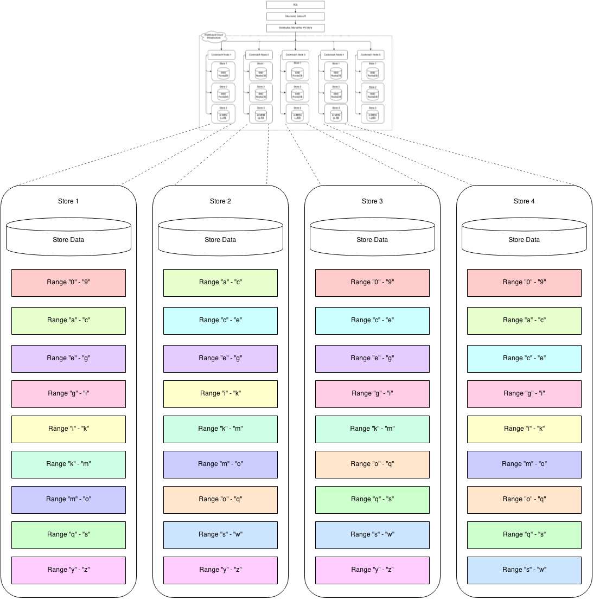

# 关于

本文档是 Spencer Kimball 在2014年早期写的最初的设计文档的一个更新版。

# 概述

CockroachDB 是一个分布式 SQL 数据库，其首要设计目标是**可扩展性**，**强一致性**和**生存性**。CockroachDB 的目标是，以最小的延迟扰乱且不需手动干预，而能够容忍磁盘、计算机，机架，甚至**数据中心**的失效。CockroachDB 节点是对称的；一个设计目标是以最小的配置且不需要额外的依赖**同质部署** （一个二进制文件）。

数据库客户端的入口点是 SQL 界面。一个CockroachDB 集群中的每个节点都可以作为一个客户端 SQL 网关。客户端 SQL 网关将客户端 SQL 语句转换为键-值（KV）操作并执行，如果需要，网关会发布到整个集群，并返回结果给客户端。CockroachDB 实现了一个**单一的、巨大的、排序的映射**，映射从键到值，其中键值都是字节串。

键值映射在逻辑上由称为域（域）的键空间的小片段构成。每个域由存储在本地的 KV 存储引擎（我们使用[RocksDB](http://rocksdb.org)，[LevelDB](https://github.com/google/leveldb) 的一个变种）中的数据支持。域数据被复制到数量可配置的其它 CockroachDB 节点上。域被合并和分裂，以维持一个目标尺寸，缺省为`64M`。相对小的尺寸有利于修复和再平衡，以处理节点失效、新的容量，甚至读/写负载。然而，尺寸必须针对系统管理更多的域所带来的压力进行平衡。

CockroachDB 实现水平可扩展性的途径：
- 添加更多的节点，通过每个节点上的存储数量来提供集群的容量（除以一个可配置的复制因子），理论上最高可达 4艾 (4E，4*2^16) 字节的逻辑数据；
- 客户端查询可被发送到集群中的任何节点，查询可独立操作（没有冲突），意即，总体吞吐量随集群中节点数量线性增长。
- 查询是分布式的（参考：分布式 SQL），因此，单个查询的总体吞吐量可以通过添加更多节点而提高。

CockroachDB 实现强一致性的途径：
- 使用一个分布式的一致协议，用于同步复制每个键值域中的数据。我们选择使用[Raft 一致算法](https://raftconsensus.github.io)；所有一致状态存储在 RocksDB 中。
- 单个域的单个或批量转换通过域的域的 Raft 实例调解。Raft 保证 ACID 语义。
- 影响多个域的逻辑转换使用分布式事务，用于 ACID 语义。CockroachDB 使用一个高效的**非锁定分布式提交**协议。

CockroachDB 实现生存性的途径：
- 域副本可以共存于一个数据中心内，已实现低延迟复制并容许磁盘或计算机故障。它们可以跨机架分布，以容许一些网络交换机故障。
- 域副本可存在于跨增长的不同的地理区域的数据中心中，以容许从数据中心或网络失效到区域电力故障的更大的故障场景，
  （如 `{ US-East-1a, US-East-1b, US-East-1c }`, `{ US-East, US-West,
  Japan }`, `{ Ireland, US-East, US-West}`, `{ Ireland, US-East,
  US-West, Japan, Australia }`）。

CockroachDB 提供 [快照隔离](http://en.wikipedia.org/wiki/Snapshot_isolation) (SI) 和可序列化快照隔离 (SSI) 语义，允许**外部一致的，无锁读和写** -- 两者都是从一个历史的快照时间戳以及当前的系统时间。SI 提供无锁的读和写，但仍然允许写偏。SSI 消除了写偏，但是在有争议的系统的情况下引入对性能的影响。SSI 是缺省的隔离；客户端必须有意识地决定为性能牺牲正确性。CockroachDB 实现了[一个有限形式的线性化](#strict-serializability-linearizability)，为任意的观察者或观察者链提供顺序。

类似于
[Spanner](http://static.googleusercontent.com/media/research.google.com/en/us/archive/spanner-osdi2012.pdf)
目录，CockroachDB 运行任意数据区的配置。这允许选择复制因子、存储设备类型，和/或数据中心位置，以优化性能和/或可用性。不同于 Spanner 的是，区是巨大的并且不允许在实体组级移动细粒度的数据。

# 架构

CockroachDB 实现了一个分层的架构。抽象的最高级是 SQL 层（当前在本文档中没有说明）。它直接依赖于 [*SQL 层*](#sql)，后者提供了熟悉的关系概念，如模式、表、列和索引。SQL 层顺次依赖于[分布式键值存储](#key-value-api)，后者处理域寻址的细节，以提供一个单一的、巨大的键值存储的抽象。分布式键值存储与任意数目的物理 CockroachDB 节点通信。每个节点有一个或多个存储，每个物理设备一个。


每个存储潜在包含很多域，即最低层的键-值数据单元。域使用 Raft 一致协议复制。下图是上图中五个节点中四个节点的放大版。每个域以三种方式使用 Raft 复制。颜色编码表示出相关的域复制。



每个物理节点提供两个基于 RPC 的键值 API：一个给外部的客户端，一个给内部的客户端（暴露敏感的运行功能）。两项服务接受批量的请求，并返回批量的回应。节点在能力和提供的界面上是对称的；每个有同样的二进制文件并且能够担任任何角色。

节点和它们提供访问的域可以布置在各种物理网络拓扑上，以在可靠性和性能之间取得平衡。；例如，一个三重（三路复制）的域可以将每个副本放在：

-   一台服务器的不同磁盘上，以容许磁盘故障。
-   一个机架的不同服务器上，以容许服务器故障。
-   一个数据中心的不同机架的不同服务器上，以容许机架电源/网络故障。
-   不同数据中心的不同服务器上，以容许大规模的网络或电力停运。

最多可以容许 `F` 个故障，其中，副本的总数为 `N = 2F + 1` （即，以 3 倍的复制，可以容许一个故障；以 5 倍的复制，可以容许两个故障，以此类推）。

# 键

CockroachDB 键是任意的字节串。键分两种：系统键和表数据键。系统键被 CockroachDB 用于内部数据结构和元数据。表数据键包含 SQL 表数据（以及索引数据）。系统和表数据键的前缀方式使得所有系统键排序在表数据键的前面。

系统键分为几个子类：

- **全局**键保存集群范围的数据，如 "meta1" 和 "meta2" 键，以及其他的系统范围的键，如节点和存储的 ID 分配器。
- **存储本地**键用于非复制的存储元数据（即，`StoreIdent` 结构）。"非复制的"意味着这些值没有被跨多个存储复制，因为它们存的数据与其存在的存储的生命周期绑定。
- **域本地**键保存域与全局键关联的元数据。域本地键有一个特别的前缀，后面是全局键和一个特别后缀。例如，事务记录是域本地键，看起来是这样的：
    `\x01k<global-key>txn-<txnID>`.
- **复制的域 ID 本地**键保存一个域的所有副本中都有的域元数据。这些键通过 Raft 操作更新。例子包括域租约状态和退出缓存条目。
- **非复制的域 ID 本地**键保存副本本地的域元数据。这样的键的主要的例子是 Raft 状态和 Raft 日志。

表数据键用于保存所有的 SQL 数据。表数据键包含在[在 SQL 模型和 KV 间映射数据](#data-mapping-between-the-sql-model-and-kv)一节中描述的内部结构。

# 带版本的值

CockroachDB 通过保存相关的提交时间戳，维护值的历史版本。读和扫描可以指定一个快照时间，以返回快照时间戳之前的最近的写。就的数据版本在压紧期间按照用户定义的到期间隔被系统垃圾回收。为了支持长时间运行的扫描（即用于 MapReduce），所有版本有一个最小的到期间隔。

对带版本的值的支持是通过修改 RocksDB 以记录提交时间戳和每天的 GC 到期间隔完成的。

# 无锁的分布式事务

CockroachDB 提供不带锁的分布式事务。CockroachDB 事务支持两个级别的隔离：

- 快照隔离（SI）和
- *可序列化*快照隔离（SSI）。

*SI* 实现简单，高效，对于除了不多的几个异常情况（即，写偏）都是正确的。*SSI* 要求一点更多的复杂性，仍旧高效（对于竞争差一点），而且没有异常情况。CockroachDB 的 SSI 实现基于来自文献和一些可能新颖的想法。

SSI 是缺省的级别，而 SI 提供给应用开发者们，他们需要足够肯定他们对于效率和不存在写偏的情况而有意识地选择使用它。在一个轻微竞争的系统中，我们的 SSI 实现就像 SI 一样高效，不需要所或者条件写。在竞争的情况下，我们的 SII 实现仍旧不需要所，但是会导致退出更多的事务。CockroachDB 的 SI 和 SSI 实现避免了饥饿的场景，甚至对于任意长的事务也是如此。

一个可能的 SSI 实现，见 [Cahill 的论文](https://drive.google.com/file/d/0B9GCVTp_FHJIcEVyZVdDWEpYYXVVbFVDWElrYUV0NHFhU2Fv/edit?usp=sharing)。这是另一篇[伟大的论文](http://cs.yale.edu/homes/thomson/publications/calvin-sigmod12.pdf)。
关于通过避免读-写冲突（相对于检测它们，称之为写-快照隔离）实现 SSI 的讨论，见
[Yabandeh 的论文](https://drive.google.com/file/d/0B9GCVTp_FHJIMjJ2U2t6aGpHLTFUVHFnMTRUbnBwc2pLa1RN/edit?usp=sharing)，这是 CockroachDB 的SSI 的更多灵感来源。

SI 和 SSI 都要求读的结果必须被保存，即，一个在比前一个读低的时间戳的键的写必须不能成功。因此，每个域维护一个有界的*内存内*缓存，从键域到被读的最后的时间戳。

大多数对于这个*时间戳缓存*的更新对应被读的键，尽管时间戳缓存也保护一些写的结果（注意是域删除），它们随后也必须填充缓存。缓存的条目首先赶出最旧的时间戳，相应更新缓存的低水位。

每个 CockroachDB 事务在开始时被分配一个随机的优先级和一个”候选时间戳“。候选时间戳是临时的时间，在那个点事务会提交，并被选为协调事务的节点的当前时钟时间。这意味着，没有冲突的事务将通常带一个以绝对时间表示的，在事务的实际工作完成之前的时间戳提交。

在一个或多个分布式节点间协调一个事务的过程中，候选时间戳可能会增长，但从不会减小。在两个隔离级别 SI 和 SSI 之间的核心差别是，前者允许事务的候选时间戳增长，而后者不会。

**混合逻辑时钟**

每个 cockroachDB 节点维护一个混合逻辑时钟（HLC），讨论见[混合逻辑时钟论文](http://www.cse.buffalo.edu/tech-reports/2014-04.pdf)。
HLC 时间使用由一个物理元素（被认为并且总是 接近本地的系统时间）和一个逻辑元素（用于区分带有同样物理元素的事件）构成的时间戳。它允许我们追踪类似于向量时间的相关事件的因果关系，但开销更小。在实践中，它的工作方式非常像其他的逻辑时钟：当事件被一个节点接收，以及当事件被发送由本地附加的 HLC 生成的时间戳，它通知本地 HLC 由发送者提供给事件的时间戳。

are received by a node, it informs the local HLC about the timestamp supplied
with the event by the sender, and when events are sent a timestamp generated by
the local HLC is attached.

关于 HLC 的更深入的描述，请阅读论文。我们的实现在
[这里](https://github.com/cockroachdb/cockroach/blob/master/pkg/util/hlc/hlc.go)。

CockroachDB 使用 HLC 时间，为一个事务选了一个时间戳。在本文档中，*时间戳*总是指 HLC 时间，它在每个节点上是个单例。
HLC 被每个节点上的每个读/写事件更新，并且 HLC 时间 >= 系统时间。在来自另一个节点的 CockroachDB 请求中收到的读/写时间戳不仅用于对操作生成版本，而且也更新节点上的 HLC。这在保证一个节点上的所有数据读/写是在一个小于下一个 HLC 时间的时间戳方面是有用的。

**事务执行流**

事务按两个阶段执行：

1. 通过选择一个可能深度涉及事务的域并写一个状态为"PENDING"的新的事务记录到一个域的保留区，从而启动该事务。与此同时，作为事务的一部分，对被写的每个数据写入一个"意向"值。这些事正常的 MVCC 值，增加了一个特殊标记（即，"intent"），表示这个值可能在事务本身提交之后被提交。另外，事务 id （唯一，而且在 txn 启动时被客户端选择）和意向值保存在一起。txn id 用于在冲突发生时指向事务记录，并用于在同样的时间戳之间的排序做出决胜局决策。每个节点返回用于写的时间戳（在没有读/写冲突的情况下，是当初的候选时间戳）；客户端从所有写时间戳中选择最大的作为最终的提交时间戳。

2. 通过更新事务记录提交事务。提交条目的值包含候选时间戳（如果需要则增长，以容纳最近的读时间戳）。注意，事务在这一点上被认为是完全提交的，而且控制被返回给客户端。

   在 SI 事务的情况下，一个被增大以容纳同时发生的写的时间戳是完全可以接受的，而且提交可以继续。然而，对于 SSI 事务，在候选和提交时间戳之间的间隔有必要重启事务。（注意：重启不同于退出 -- 键下文）。

   事务被提交后，所有的写意向通过移除"intent"标记被并行升级。在这一步之前，事务被认为是完全提交的，并且不等待返回控制给事务协调器。

如果没有冲突，这就是结束了。不需要任何事情来保证系统的正确性。

**冲突解决**

当一个读者或者写者在一个位置遇到一个它需要读或者写的意向记录或者新提交的值时，事情变得更有趣了。这是一个冲突，通常造成事务退出或者重启，取决于冲突的类型。

***事务重启:***

这是通常（也是更高效）的行为类型，而且被用于除了事务被（例如，被另一个事务）退出的情况。

实际上，这被缩减为两种情况；第一种是上面列出的：SSI 事务找到试图提交，而提交时间戳被推。第二种情况涉及一个事务频繁遇到冲突，即，它的一个读者或者写者需要需要解决冲突的数据（见下面的事务交互）。
above: An SSI transaction that finds upon attempting to commit that
its commit timestamp has been pushed. 

当一个事务重启，它改变了优先级和/或将其时间戳向前移动，这取决于绑定到冲突的数据，并开始重新使用同一个 txn id。事务的前一次运行可能写了一些写意向，这些需要在事务提交之前删除，从而不必包含为事务的一部分。这些陈旧的写意向删除在事务的再次执行期间完成，或者是隐式地写作为重新执行事务的一部分的新的意向到同样的键，或者是显式地通过清除不是重新执行事务的一部分的陈旧意向。由于大部分事务最终写到同样的键，显式清除恰好在提交事务之前运行通常是一个空操作。

***事务退出:***

在这种情况下，一个事务在读了它的事务记录后，发现它被退出了。此时，事务不能重用它的意向；它在清理意向（其他的读者和写者在遇到无主的意向时会清理）之前将控制返回给客户端，但会随后努力清理它们。下一个尝试（如果可用）用一个**新的 txn id**运行一个新的事务。

***事务交互:***

事务交互的几种情形：

- **读者遇到带有远在将来的时间戳的写意向或值**：
  这不是冲突。读者可以自由继续；毕竟，它将读到一个旧的值因而不冲突。记得写意向可能以一个比它的候选晚的时间戳提交；它从不会一个早的时间戳提交。**边注**：如果一个 SI 事务读者发现一个该读者自己的事务写的带有较新的时间戳的意向，该读者总是返回那个意向的值。

- **读者遇到带有不远的将来的较新的时间戳的写意向或值**：
  在这种情况下，我们得小心处理。较新的意向，绝对发生在我们的读的过去，如果写者的时钟在提供值的节点之前。在这种情况下，我们需要将这个值考虑在内，但是我们恰恰不知道。因此，事务重启，使用一个将来的时间戳（但记住用于限制最大时钟偏移的不确定性窗口的最大时间戳）。实际上，这个被进一步优化了；见下面"选择一个时间戳"条目下的细节。

- **读者遇到带有旧的时间戳的写意向**：
  读者必须按照意向的事务 id 找到事务的记录。如果事务已经被提交，读者可以只读取值。如果写事务还没有被提交，读者有两个选择。如果写冲突来自一个 SI 事务，读者可以*将事务的提交时间戳推到将来*（并因此不必读它）。容易去做：读者仅更新事务的提交时间戳以表明当/如果事务确实提交，它应该使用一个*至少*同样高的时间戳。而然，如果写冲突来自一个 SSI 事务，读者必须比较优先级。如果读者有更高的优先级，它将推后事务的提交时间戳（事务将注意到它的时间戳被推后了，并重启）。如果有较低或同样的优先级，它使用一个新的优先级 `max
(新的优先级，冲突的 txn 的优先级 - 1)` 重试自己。

- **读者遇到未提交的写意向**：
  如果其他写意向被一个带有较低优先级的事务写入，写者退出冲突的事务。如果写意向有较高或同样的优先级，事务以一个新的优先级 *max(新的随机优先级，冲突 txn 的优先级 - 1)* 重试；重试发生在一个短的、随机的退避间隔。

- **写者遇到较新的已提交的值**：
  已提交的值可能也有一个由已提交的事务造成的未解决的写意向。事务重启。重启时，使用同样的优先级，但是候选时间戳被移动为遇到的值的时间戳。

- **写者遇到更近的被读的键**：
  *读时间戳缓存* 咨询节点上的每个写。如果写的候选时间戳早于缓存自己的低水位（即，它的最后被驱逐的时间戳），或者，被写的键有一个晚于写的候选时间戳的读时间戳，这个晚些的时间戳值被写返回。只有当它是可序列化时，一个新的时间戳迫使一个事务重启。

**事务管理**

事务由客户端代理（SQL Azure 的叫法是网关）管理。不同于Spanner，写不被缓存，而是直接发给所有的隐含的域。
这允许事务遇到写冲突时快速退出。客户端代理追踪所有的被写键以在事务完成时异步解决所有的写意向。如果一个
事务成功提交，所有意向被升级为已提交。在事务被退出的情况下，所有被写的意向被删除。客户端代理不保证它会
解决意向。

在客户端在等待的事务被提交之前重启，无主的事务将继续"存在"，知道被另一个事务退出。事务定期心跳其事务记录，
以维持活跃度。

被带有在要求的间隔未被心跳的无主意向的读者和写者遇到的事务被退出。在事务提交之后当在异步解决完成之前代理
重启的情况下，当被未来的读者和写者遇到，而且系统不依赖于及时解决保证正确性，无主的意向被升级。

[这里](https://docs.google.com/document/d/1kBCu4sdGAnvLqpT-_2vaTbomNmX3_saayWEGYu1j7mQ/edit?usp=sharing)
是一个对带竞争的重试和对放弃的事务的退出次数的探索。

**事务记录**

最新的结构，请见 [pkg/roachpb/data.proto](https://github.com/cockroachdb/cockroach/blob/master/pkg/roachpb/data.proto)，
最佳的入口是`消息事务`。

**优势**

- 不需要可靠的节点执行以避免停滞的两阶段提交（2PC）协议。
- 用 SI 语义，读者从不会阻塞；用 SSI 语义，它们可能会退出。
- 比传统的两阶段提交协议延迟低（没有竞争），因为第二阶段只需要对事务记录的当个写，
  而不是一个对所有事务参与者的同步回合。
- 优先级避免了对任意长的事务的饥饿，并总是在竞争的事务（没有相互退出）中选取一个
  胜利者。
- 写在客户端不被缓存；写快速失败。
- 对可序列化的 SI （相对于其他的 SSI 实现）不需要读锁定开销。
- 良好选择的（即，较少随机）优先级能够灵活地给予任意事务在延迟上的概率保证（例如，
  相比于低优先级的事务，如异步调度的任务，使得 OLTP 事务退出的可能性是十分之一。

**劣势**

- 从非租约持有者复本的读仍然要求提醒租约持有者更新*读时间戳缓存*。
- 被放弃的事务可能阻塞竞争的写者最大到心跳间隔，尽管平均等待可能被认为更短（见
  [链接里的图](https://docs.google.com/document/d/1kBCu4sdGAnvLqpT-_2vaTbomNmX3_saayWEGYu1j7mQ/edit?usp=sharing)）。
  相比于检测并重启 2PC 以释放读和写锁，这可能是相当地更长。
- 不同于其他 SI 实现的行为：没有第一个写者赢，而且短的事务并不总是快速结束。
  对 OLTP 系统的惊异元素可能是一个问题因素。
  Element of surprise for OLTP systems may be a problematic factor.
- 与两阶段锁定相比，退出会降低一个竞争系统的吞吐量。退出和重试增加了读和写的流量，
  提高了延迟并降低了吞吐量。

**选择一个时间戳**

从带有时钟偏移的分布式系统读取数据的一个关键挑战是选择一个时间戳，确保大于最后任何
被提交事务的时间戳（按绝对时间）。没有系统能够声称一致性并无法读取已经提交的数据。

达到访问一个节点的事务（或仅仅单个操作）的一致性是容易的。时间戳有节点本身分配，因此，
确保了是一个比该节点上所有现存时间戳数据都大的时间戳。

对于多个节点，使用协调事务的节点的时间戳 `t`。另外，提供一个最大的时间戳 `t+ε `
作为已经提交的数据的时间戳上限 （`ε`是最大的时钟偏移）。随着事务的进展 ，任何时间戳大于
`t` 但小于 `t+ε` 的数据读造成事务退出并以冲突的时间戳 t<sub>c</sub>，其中 t<sub>c</sub> \> t。
最大时间戳 `t+ε` 不变。这意味着，事务由于时钟的不确定性重启只能发生在一个长度为 `ε`的时间间隔。

我们使用另外一个优化以减少由于不确定性造成的重启。在重启的时候，事务不仅考虑
 t<sub>c</sub>，而且也要考虑在不确定读时的节点时间戳 t<sub>node</sub>。两个时间戳
t<sub>c</sub> 和 t<sub>node</sub> 中较大的（可能等于后者）被用于增大读时间戳。
另外，冲突的节点被标记为 “certain。随后，为了对事务中那个节点的未来的读，我们设置
 `MaxTimestamp = 读时间戳`，避免进一步的不确定性重启。

正确性来自于以下事实，我们知道，在读的时候，节点上没有任何键的版本的时间戳大于
t<sub>node</sub>。在由节点造成的重启时，如果事务遇到一个有更大时间戳的键，它知道，
按绝对时间，值在 t<sub>node</sub> 得到之后，即在非确定读之后，被写入。因此，事务
能够将读数据的一个较旧的版本向前移动（在事务的时间戳）。这样将对一个节点的时间非确定性
重启限制为最多一个。权衡是，我们可能选取一个大于最理想的时间戳（大于最大的冲突时间戳），
结果是新的冲突比较少。

我们期望重试会比较少，但是如果重试成了问题，这个假设可能需要重新考虑。注意，这个
问题不适用于历史读。一个代替的方法不要求重试，提前对所有的节点参与者做一轮，并
选择被报告的最高节点系统时间作为时间戳。然而，知道那个节点将被提前访问是困难的，
而且，可能是有限的。CockroachDB 也可能使用一个全局的时钟（谷歌使用
 [Percolator](https://www.usenix.org/legacy/event/osdi10/tech/full_papers/Peng.pdf))，
这对于较小的、地理位置上接近的集群是可行的。

# 严格序列化（线性化）

大致来说，在 <i>strict serializability</i> （我们和 <i>linearizability</i> 互换使用) 
和 CockroachDB 的缺省隔离级别 (<i>serializable</i>) 之间的差距是，对于可线性化的事务，
因果关系被保留。即，如果一个事务（比如，为一个用户创建一个发帖）等待它前面的事务
（首先创建用户）完成，用户会希望分配给前者的逻辑时间戳大于后者的。

实际上，对于分布式数据库可能不是这样的，典型的原因是，在一个分布式系统中的时钟不是被
完美同步的，而且，”后来的“事务触碰了部分非连接，而第一个事务在上面运行，结果是，
带有非连接信息的时钟决定提交的时间戳。
and the "later" transaction touches a part disjoint from that on which the
first transaction ran, resulting in clocks with disjoint information to decide
on the commit timestamps.

实际上，在 CockroachDB 中，很多事务性的负载实际上是线性化的，尽管确切的情况过于复杂，
难以在这里列出。

因果关系通常对于很多事务是不需要的，因此，只有在它*确实*需要的时间才用是有利的。
CockroachDB 通过<i>因果令牌</i>实现了这个：当提交一个事务时，一个因果关系令牌被获取
并传递给下一个事务，保证这两个事务被分配递增的逻辑时间戳。

另外，随着更好同步的时钟成为云服务商提供的标准商品，CockroachDB 通过做与
[谷歌的 Spanner](http://research.google.com/archive/spanner.html) 基本相同的：
在提交后但在返回给客户端之前等待最大的时钟抵消完成，能够提供全局的线性化。

更深入的信息，见下面的博客帖子。

https://www.cockroachlabs.com/blog/living-without-atomic-clocks/

# 逻辑映射内容

逻辑上，映射在实际用户数据之前（这些由 SQL 子系统管理）包含一系列保留的系统键/值对。

- `\x02<key1>`: 域结尾 `\x03<key1>` 的域元数据。 这是一个 "meta1" 键。
- ...
- `\x02<keyN>`: 域结尾 `\x03<keyN>` 的域元数据。 这是一个 "meta1" 键。
- `\x03<key1>`: 域结尾 `<key1>` 的域元数据。 这是一个 "meta2" 键。
- ...
- `\x03<keyN>`: 域结尾 `<keyN>` 的域元数据。 这是一个 "meta2" 键。
- `\x04{desc,node,域,store}-idegen`: 对于各种元素类型的 ID 生成神谕。
- `\x04status-node-<varint encoded Store ID>`: 存储运行时元数据。
- `\x04tsd<key>`: 时间序列数据键。
- `<key>`: 一个用户键。实际上，这些键由 SQL 子系统管理，它使用自己的键剖析。

# 存储和存储空间

节点包含一个或多个存储。每个存储应该放在一个唯一的磁盘上。
在内部，每个存储包含一个单独的 RocksDB 实例，带有一个在节点上所有存储间共享的块缓存。
这些存储顺次有域副本的一个集合。一个域的多余一个的副本从不会被放在同样的存储甚至同一个节点上。

早期，当一个首先初始化时，不多的缺省初始域将只有一个单一的副本，但是，一旦其他的节点可用，
它们将复制直到它们达到它们期望的复制因子，缺省为 3。

区配置可以被用作控制一个域的复制因子并添加域的副本可以放在哪里是限制。当域的区配置发生变化时，
域将根据区的配置限制，增加或减少副本的数目到合适的值，并移动副本到合适的存储。

# 自修复

如果一个存储在一段时间内，缺省是 5 分钟，没有被听到（闲聊它们的描述符），集群将认为这个存储死了。 
当这种情况发生时，所有在那个存储上有副本的域被定为不可用并移除。这些域将随后向上复制它们自己到其他
可用的存储，直到达到它们期望的复制因子。如果 50% 或更多的副本同时不可用，没有法定人数而且整个域将
被认为不可用直到最少多于 50% 的副本再次可用。

# 再平衡

随着更多的数据被加入到系统中，一些存储的增长可能快于其他的存储。为了克服这一点并将总体负载发散到
整个集群，副本将在存储间移动，以维护期望的复制因子。用于执行整个再平衡的启发式包括：

- 每个存储的副本数量
- 每个存储使用的数据整体大小
- 每个存储可用的自由空间

将来，可能被考虑的其他因素包括：

- 每个存储的 cpu/网络负载
- 在查询中一起使用的域
- 每个存储的活跃域的数量
- 每个存储保有的域租约数量

# 域元数据

域的缺省近似大小是 is 64M (2\^26 B)。为了支持 1P (2\^50 B) 逻辑数据，需要大约 
2\^(50 - 26) = 2\^24 个域的元数据。域元数据大小的一个合理上限大约是 256 字节 
(3\*12 字节用于三倍的节点位置，220 字节用于域键本身)。2\^24 个域 \* 2\^8 B 将
需要大约 4G (2\^32 B) 用于存放 -- 在机器之间复制太大了。结论是，对于大的安装，域
元数据必须被分散。

为了让键检索在分散的元数据的情况下保持相对快速，我们将所有的顶级元数据存放在一个单一的
域(第一个域)中。这些顶级元数据键被称为 *meta1* 键，并加上前缀，使得它们在键空间中排在
开始的位置。由于上面给出的 256 字节的元数据大小，单一的 64M 域将支持 64M/256B = 2\^18 
个域，这总共是 64M \* 2\^18 = 16T 的存储空间。为了支持上面提到的 1P，我们需要两级间接
寻址，其中，第一级寻址第二级，第二级寻址用户数据。使用两级间接寻址，我们可以寻址 
2\^(18 + 18) = 2\^36 个域；每个域寻址 2\^26 B，总共我们可以寻址 
2\^(36+26) B = 2\^62 B = 4E 用户数据。

对于一个给定的用户可寻址 `key1`，相关的 *meta1* 记录在 *meta1* 空间中的 `key1` 的后继键找到。
因为，*meta1* 空间是稀疏的，后继键被定义为存在的下一个键。*meta1* 记录确定包含 *meta2* 
记录的域，它使用同样的过程找到。*meta2* 记录确定包含 `key1` 的域，它又以同样的方式找到（见
下面的例子中）。

具体来说，元数据键被加上前缀 `\x02` (meta1) 和 `\x03` (meta2)；前缀 `\x02` 和 `\x03` 提供了
期望的排序行为。因此， `key1`'s *meta1* 记录将位于 `\x02<key1>` 的后继键。

注：我们将每个域的结尾键附加给 meta{1,2} 记录，因为 RocksDB 迭代器只支持一个 Seek() 界面，
它是作为一个 Ceil()。使用域的开始键将造成 Seek() 寻找在我们正在寻找的索引记录的元数据*之后*的
键，这将导致不得不备份迭代器，这是一个既低效也不是在所有情况下可用的选择。

下面的例子展示了有三个域数据的映射的目录结构。
directory structure for a map with three ranges worth of data. 

省略号表示填充整个数据域的另外的键/值对。为了清晰，例子使用 `meta1` 和 `meta2` 指前缀 `\x02` 
和 `\x03`。除了分裂域需要知道元数据布局的域元数据更新的事实外，域元数据本身不需要特别的处理或引导。

**域 0** (位于服务器 `dcrama1:8000`, `dcrama2:8000`, `dcrama3:8000`)

- `meta1\xff`: `dcrama1:8000`, `dcrama2:8000`, `dcrama3:8000`
- `meta2<lastkey0>`: `dcrama1:8000`, `dcrama2:8000`, `dcrama3:8000`
- `meta2<lastkey1>`: `dcrama4:8000`, `dcrama5:8000`, `dcrama6:8000`
- `meta2\xff`: `dcrama7:8000`, `dcrama8:8000`, `dcrama9:8000`
- ...
- `<lastkey0>`: `<lastvalue0>`

**域 1** (位于服务器 `dcrama4:8000`, `dcrama5:8000`, `dcrama6:8000`)

- ...
- `<lastkey1>`: `<lastvalue1>`

**域 2** (位于服务器 `dcrama7:8000`, `dcrama8:8000`, `dcrama9:8000`)

- ...
- `<lastkey2>`: `<lastvalue2>`

看一个简单些的例子，一个包含少于一个单个数据域的映射。在这个例子中，所有的域元数据和所有的数据
位于同一个域中：

**域 0** (位于服务器  `dcrama1:8000`, `dcrama2:8000`, `dcrama3:8000`)*

- `meta1\xff`: `dcrama1:8000`, `dcrama2:8000`, `dcrama3:8000`
- `meta2\xff`: `dcrama1:8000`, `dcrama2:8000`, `dcrama3:8000`
- `<key0>`: `<value0>`
- `...`

最后，一个足够大需要两级间接寻址的映射会是这样的 (注意这个例子简化了只显示域索引，而没有显示域副本)：

**域 0**

- `meta1<lastkeyN-1>`: 域 0
- `meta1\xff`: 域 1
- `meta2<lastkey1>`:  域 1
- `meta2<lastkey2>`:  域 2
- `meta2<lastkey3>`:  域 3
- ...
- `meta2<lastkeyN-1>`: 域 262143

**域 1**

- `meta2<lastkeyN>`: 域 262144
- `meta2<lastkeyN+1>`: 域 262145
- ...
- `meta2\xff`: 域 500,000
- ...
- `<lastkey1>`: `<lastvalue1>`

**域 2**

- ...
- `<lastkey2>`: `<lastvalue2>`

**域 3**

- ...
- `<lastkey3>`: `<lastvalue3>`

**域 262144**

- ...
- `<lastkeyN>`: `<lastvalueN>`

**域 262145**

- ...
- `<lastkeyN+1>`: `<lastvalueN+1>`

注意，选择 域 `262144` 仅仅是一个近似值。通过一个单个元数据域可寻址的域的实际数量取决于键的
大小。如果试图保持小的键尺寸，可寻址的域总数会增加，反之亦然。

从上面的例子中可以清楚看到，键位置检索需要最多三次读以得到 `<key>` 的值：

1. `meta1<key>` 的下限
2. `meta2<key>` 的下限，
3. `<key>`。

对于小的映射，整个查询在一次对域 0 的 RPC 完成。包含少于 16T 数据的映射将需要两次查询。
客户端缓存两级的域元数据，我们期望对于各个客户端的数据本地性将会是高的。客户端可能会
留有陈旧的缓存内容。如果在一次查询中，被咨询的域没有满足客户端的期望，客户端驱逐了陈旧的
缓存内容并可能进行一次新的查询。

# Raft - 域副本的一致性

每个域被配置由三个或更多的副本构成，在它们的 ZoneConfig 中指定。一个域中的副本维护它们自己的
分布式共识算法。我们使用[*Raft 共识算法*](https://raftconsensus.github.io)，因为它易于理解
并包括一个覆盖重要细节的参考实现。
[ePaxos](https://www.cs.cmu.edu/~dga/papers/epaxos-sosp2013.pdf) 具有对广域网分布式
负载有前途的性能特征，但是它不保证副本之间的一致顺序。

Raft 选举一个生存期相对长的领导者，它必须参与提出命令。它定期对对追随者发出心跳并复制它们的
心跳。在没有心跳的情况下，追随者在一个随机的选举超时之后变为候选，并继而举行新的领导者选举。
 CockroachDB 衡量随机的超时，这样，具有到同等副本较短的往返时间的副本更可能首先举行选举（尚未实现）。
 只有 Raft 领导者可以提出命令；追随者仅仅将命令传给最后知道的领导者。

我们的 Raft 实现是和 CoreOS 一起开发的，但是增加了额外的一层优化，以处理单一节点可能有数百万
共识组（每个域一个共识组）的事实。优化的领域主要是合并心跳（这样，节点的数量而不是大的额多的
域的数量决定了心跳的数量）和请求的批量处理。
进一步的优化可能包含两阶段选举和休眠域。（即，对不活跃的域完全停止流量）。

# 域租约

如在 Raft 一节中提到的，一个域的副本被组织为 Raft 组，并从它们共享的提交日志执行命令。
虽然通过Raft 是一个昂贵的操作，有些任务应该在一个时间由一个副本（而不是所有的）执行。
特别的，从一个单一副本提供权威性读是可取的。

出于这些原因，CockroachDB 引入了**域租约**的概念：
这是一个（数据库，即，混合逻辑）时间的一个租约。一个副本通过 Raft 提交一个特别的租约
获取日志条目而使其获得租约。日志条目包含来自节点副本活跃度表 -- 一个包含时间戳和每个
节点的有效时间的系统表，的节点时期。每个节点负责持续更新它在活跃度表中的有效时间。一
旦租约通过 Raft 被提交，只要副本使用了租约获取命令，它马上变为租约的持有者，保证了当
它使用租约时，它已经将以前的所有的写应用于该副本并能在本地看到它们。

为防止两个节点获得租约，请求者收录了在它认为在它请求租约时有效的租约拷贝。当新的租约
被应用时，如果被收录的租约仍旧有效，则被发放，否则，另一个租约在过渡期被发放，而被请
求的租约被忽略。只有当节点 A 的活跃度记录失效而且它的时间戳被被增加后，租约可以从节点
A 移到节点 B。

注：在节点活跃度表键空间和所有在它之前的域，包括meta1 和 meta2，的域租约，不使用上面的
机制管理以避免循环依赖。

只要节点时间戳不改变而且有效时间没有过，在一个特定时间戳持有一个租约的副本就能只用这个
租约。持有副本的副本可能在本地满足读，而不需要引发通过 Raft 的开销，而且负责或参与处理
特定于域的维护任务，如分裂、合并和再平衡。

所有的读和写一般分给持有租约的副本；如果没有，可以选择任意副本，使它试图同步获取租约。
被非租约持有者（对于在请求者的头中指定的 HLC 时间戳）收到的请求失败，错误指向副本最后
知道的租约持有者。这些请求被网关节点用更新的租约透明地重试，而且从不会到达客户端。

由于读绕过了 Raft，一个新的租约持有者，和其他事物一起，确保它的时间戳缓存不报告比以前
的租约持有者小的时间戳（因此，它和可能发生在前一个租约持有者的读兼容）。这是通过在租约
的实际到期之前让租约进入一个<i>淤滞期</i> （即到期时间减去最大时钟位移）做到的，因此，
下一个租约持有者要做的是设置时间戳缓存的低水位为它的新租约的开始时间。

当租约进入它的淤滞期，不提供任何的读和写。这是不受欢迎的。然而，在实际中只有一个节点变为
不可同才会发生。在绝大部分的实际情形中，不可用不会发生，因为租约通常是长期的（和/或被
急切地延长，这可以避免淤滞期）或从租约持有者主动转移走，通过承诺不提供任何进一步的读知道
下一个租约生效，这也能避免淤滞期。

## 与 Raft 领导地位共存

域租约与 Raft 领导地位完全分离，因此，如果没有进一步的动作， Raft 领导地位和域租约
不能被同一个副本持有。由于不合并这两个角色是昂贵的（租约持有者必须每个建议转给领导者，
增加了高代价的 RPC 往返），每个租约延期或转移也试图合并它们。实际上，这意味着不匹配
极少而且自纠正是快速的。

## 命令执行流

这一小节更详细地描述了一个租约持有者副本如何处理一个读写命令。每条命令指定 (1) 命令
访问的一个键（或键的一个域），(2) 键属于的的域的 ID。当收到一条命令，节点按照域 ID 
检索域，并检查域是否仍旧负责所提供的键。如果任何键不属于这个域，节点返回错误，因此，
客户端将重试并发送一个请求到一个争取的域。

如果所有的键属于该域，节点试图处理这条命令。如果，命令是一条不一致的只读命令，它被
立即处理。如果命令是一致的读或写，当下面两个条件满足时，命令被执行：

- 域副本有一个域租约。
- 没有其他运行命令的键与被提交的命令交叠并造成读/写冲突。

当第一个条件不满足，副本试图获得一个租约或者返回一个错误，因此，客户端将命令重定向到
当前的租约持有者。第二个条件保证对于一个给定键的一致的读/写命令被顺序执行。

如果以上两个条件被满足，租约持有者副本处理命令。一致的读在租约持有者上被立即处理。
写命令被提交到 Raft 日志，这样，每个副本将执行同样的命令。所有的命令产生确定性的结果，
因此，域副本在它们之间保持一致状态。

当一个写命令完成，所有的副本更新它们的响应缓存以保证幂等。当一个读命令完成，租约持有者
副本更新其时间戳缓存以追踪一个给定键的最后读。

有可能当一条命令执行时一个域租约过期。在执行一条命令之前，每个副本检查建议命令的副本
是否有一个静止的租约。当租约过期，命令将被副本拒绝。

# 分裂/合并域

节点根据它们是否超出了容量或负载的最大或最小界限分裂或合并域。超出了容量或者负载最大界限
的域被分裂，低于容量*和*负载最小界限的域被合并。

域维护会计统计作为会计键的前缀。这些最小为分钟粒度的一个时间序列数据点。从字节的数目到
读/写队列的大小的一切。会计统计数据的任意摘要可被决定为分裂/合并的基础。两个用于分裂/合并
的实用的度量数据是以字节计算的域大小和IOps。用于从一个节点到另一个节点的副本再平衡的一个
好的度量是读/写队列等待的总时间。这些度量被闲话，对于每个域/节点传递相关的度量，如果它们
在它知道的域的底部或顶部。

发现自己超出容量或负载的界限的域分裂。为此，域租约持有者计算一个适当的分裂键候选并通过
Raft 发出分裂。相比于分裂，合并要求域低于容量*和*负载的下限。被合并的域选择它前面和后面
的域中较小的一个。

分裂、合并、再平衡和恢复都遵循同样的基本算法在节点间移动数据。新的目标副本被创建并添加到
源域的副本集合。随后，每个新的副本被更新，或者是通过完整重播日志，或者是通过拷贝一个源副本
数据的快照并从快照的时间戳重播日志以完全赶上。一旦新的副本被完全更新，域元数据被更新，而且，
如果适用，旧的、源副本被删除。

**协调者** （租约持有者副本）

```
if 分裂
  分裂域(split_key): 分裂发生在域副本本地而且只在本地完成后，被移动到目标副本。
else if 合并
  在同样的服务器上选择新的副本作为目标域副本；添加到副本集合。
else if 再平衡 || 恢复
  在最小负载的服务器上选择副本；添加到副本集合。
```

**新副本**

*更新副本：*

```
if 所有数据可以从被复制的日志读取
  拷贝复制的日志
else
  快照源副本
  发送连续的读域请求到源副本
  引用快照

if 合并
  在所有的副本上合并域
else if 再平衡 || 恢复
  移除旧的域副本
```

当在一个域中的所有数据超出了一个可配置的最大界限时，节点分裂域。类似地，当所有数据低于一个
可配置的最小界限，域被合并。

**待定：充实之**: 特别对于合并（以及再平衡），我们有一个域从本地节点消失；该域需要优雅地消失，
将操作平稳地交给其数据的新的所有者。

如果一个节点基于闲话的负载数据，决定了它的负载或容量是集群中最差的之一，域被再平衡。在同样的
数据中心内有空余容量的节点被选择，而且，完成一个特别情况的分裂，它只是 1:1 复制数据并重置域
配置元数据。

# 节点分配（通过 Gossip）

当域分裂时，新的节点必须被分配。不需要每个节点知道所有或者一个大数目的对等节点的状态 --或者-- 
一个具有足够全局知识的监护人节点或者主节点，我们使用闲话 (gossip) 协议在集群中所有节点间有效
沟通有意义的信息。什么事有意义的信息？一个例子是，一个特定的节点是否有很多空余容量。每个节点，
在闲话的时候，将闲话的每个话题与自己的状态比较。如果它自己的状态比它最近看到的话题中的最没有
意义的在某种程度上“更有意义”，它将自己的状态包含作为与一个对等节点的下一次闲话会话的一部分
。用这种方式，一个具有足够多容量超过平均数的节点很快被整个集群发现。为避免堆放在局外，高容量
集合中的节点被随机选择分配。

闲话协议本身包含两个主要元素：

- **对等选择**：每个节点维护最多 N 个对等节点用于经常通信。它着眼于最大化扇出选择对等节点。
  相比于一个与一组有很大重叠的节点，一个对等节点本身与一系列不然的话不知道的节点会被选择。
  每次闲话被启动，每个节点的对等节点集合互相交换。然后，如果认为合适，每个节点可以自由并入
  其他节点的对等节点。为避免任何节点苦于过多的来的请求，一个节点可能拒绝回答一个闲话交换。
  每个节点偏向于回答来自没有重大重叠的节点的请求，并拒绝其他的请求。

  节点的有效选择使用
  [Agarwal & Trachtenberg (2006)](https://drive.google.com/file/d/0B9GCVTp_FHJISmFRTThkOEZSM1U/edit?usp=sharing) 
  中描述的一个启发。

  **待定**：如何避免分区？需要作出协议的一个模拟，以调整行为并观察在经验上它工作得怎么样。

- **闲话选择**：沟通什么。闲话被分为话题。负载特征（每个磁盘的容量，CPU 负载，以及状态
  [即，过载、好、失败]）被用于驱动节点分配。域统计数据（域 读/写，消失的副本，不可用的域）
  和网络拓扑（机架间带宽/延迟，数据中心间带宽/延迟，子网停运）被用于决定何时分裂域，何时恢复
  副本 vs. 等待网络连接，以及用于调试/系统操作（sysops）。在所有的情况中，一组最小值和一组
  最大值被传播；每个节点使用自己的世界观增加值每个最小和最大值被打上报告节点的标签，以及其他
  伴随的语境信息。闲话的每个话题有其自己的 protobuf 用以保留结构化的数据。每个话题的闲话条目
  数量受限于一个可配置的界限。

  出于高效的目的，节点分配闲话的每个新的话题一个序列号，并追踪每个对等节点看到过的最高序列号。
  每轮闲话只沟通包含新条目的变化。

# 节点和集群度量

系统的每个元素负责输出关于它自己的有意义的度量数据。这些可以是直方图、吞吐量计数，或者标准尺寸。

这些度量数据被输出通过一个 HTTP 端点用于外部的监视系统（比如 Prometheus），但是 CockroachDB 也实现
了一个内部的时间序列数据库，它存放在被复制的键-值映射中。

时间序列被以存储（Store）粒度存放，并允许管理仪表板有效地获取集群、节点和存储级别数据的全局可见性。
[周期性背景处理](RFCS/time_series_culling.md)扑杀旧的时间序列数据，下采样并最终丢弃。

# 键前缀会计和区

任意细粒度的会计信息通过键前缀指定。如果必要，键前缀可以重叠，以获取分级关系。为了说明的目的，
我们可以说，在一组数据库中指定行的键有如下格式：

`<db>:<table>:<primary-key>[:<secondary-key>]`

在这种情况下，我们可能用下面的键前缀收集会计信息：

`db1`, `db1:user`, `db1:order`,

会计信息缺省为整个映射保留。

## 会计

为保留一个由键前缀定义的域的会计信息，在会计系统表中创建一个条目。会计表的键格式是：

`\0acct<key-prefix>`

实际上，因为会计表相对小，我们假设每个节点能够缓存整个会计表。

为了高效，会计信息为键前缀域保留有最终一致性。有两类值构成会计信息：计数和事件，没有更好的
名称了。计数描述系统状态，如总字节数、行数等等。事件包括短暂的性能和负载度量数据。会计的
两种类型被捕捉为分钟粒度的时间序列会计度量保留的时间长度是可配置的。下面是每种会计值类型的例子。

**系统状态计数器/性能**

- 条目（即，行）数
- 字节总数
- 键字节总数
- 值总长度
- 排队的消息数
- 排队消息总字节
- 值数目 \< 16B
- 值数目 \< 64B
- 值数目 \< 256B
- 值数目 \< 1K
- 值数目 \< 4K
- 值数目 \< 16K
- 值数目 \< 64K
- 值数目 \< 256K
- 值数目 \< 1M
- 值数目 \> 1M
- 会计总字节数


**负载发生**

- 得到 op 数
- 得到总 MB
- 设置 op 数
- 设置总 MB
- 删除 op 数
- 删除总 MB
- 删除域 op 数
- 删除域总 MB
- 扫描 op 数
- 扫描 op MB
- 分裂数
- 合并数

Because accounting information is kept as time series and over many
possible metrics of interest, the data can become numerous. Accounting
data are stored in the map near the key prefix described, in order to
distribute load (for both aggregation and storage).

Accounting keys for system state have the form:
`<key-prefix>|acctd<metric-name>*`. Notice the leading ‘pipe’
character. It’s meant to sort the root level account AFTER any other
system tables. They must increment the same underlying values as they
are permanent counts, and not transient activity. Logic at the
node takes care of snapshotting the value into an appropriately
suffixed (e.g. with timestamp hour) multi-value time series entry.

Keys for perf/load metrics:
`<key-prefix>acctd<metric-name><hourly-timestamp>`.

`<hourly-timestamp>`-suffixed accounting entries are multi-valued,
containing a varint64 entry for each minute with activity during the
specified hour.

To efficiently keep accounting over large key 域s, the task of
aggregation must be distributed. If activity occurs within the same
域 as the key prefix for accounting, the updates are made as part
of the consensus write. If the 域s differ, then a message is sent
to the parent 域 to increment the accounting. If upon receiving the
message, the parent 域 also does not include the key prefix, it in
turn forwards it to its parent or left child in the balanced binary
tree which is maintained to describe the 域 hierarchy. This limits
the number of messages before an update is visible at the root to `2*log N`,
where `N` is the number of 域s in the key prefix.

## 区

zones are stored in the map with keys prefixed by
`\0zone` followed by the key prefix to which the zone
configuration applies. Zone values specify a protobuf containing
the datacenters from which replicas for 域s which fall under
the zone must be chosen.

Please see [pkg/config/config.proto](https://github.com/cockroachdb/cockroach/blob/master/pkg/config/config.proto) for up-to-date data structures used, the best entry point being `message ZoneConfig`.

If zones are modified in situ, each node verifies the
existing zones for its 域s against the zone configuration. If
it discovers differences, it reconfigures 域s in the same way
that it rebalances away from busy nodes, via special-case 1:1
split to a duplicate 域 comprising the new configuration.

# SQL

Each node in a cluster can accept SQL client connections. CockroachDB
supports the PostgreSQL wire protocol, to enable reuse of native
PostgreSQL client drivers. Connections using SSL and authenticated
using client certificates are supported and even encouraged over
unencrypted (insecure) and password-based connections.

Each connection is associated with a SQL session which holds the
server-side state of the connection. Over the lifespan of a session
the client can send SQL to open/close transactions, issue statements
or queries or configure session parameters, much like with any other
SQL database.

## 语言支持

CockroachDB also attempts to emulate the flavor of SQL supported by
PostgreSQL, although it also diverges in significant ways:

- CockroachDB exclusively implements MVCC-based consistency for
  transactions, and thus only supports SQL's isolation levels SNAPSHOT
  and SERIALIZABLE.  The other traditional SQL isolation levels are
  internally mapped to either SNAPSHOT or SERIALIZABLE.

- CockroachDB implements its own [SQL type system](RFCS/typing.md)
  which only supports a limited form of implicit coercions between
  types compared to PostgreSQL. The rationale is to keep the
  implementation simple and efficient, capitalizing on the observation
  that 1) most SQL code in clients is automatically generated with
  coherent typing already and 2) existing SQL code for other databases
  will need to be massaged for CockroachDB anyways.

## SQL 架构

Client connections over the network are handled in each node by a
pgwire server process (goroutine). This handles the stream of incoming
commands and sends back responses including query/statement results.
The pgwire server also handles pgwire-level prepared statements,
binding prepared statements to arguments and looking up prepared
statements for execution.

Meanwhile the state of a SQL connection is maintained by a Session
object and a monolithic `planner` object (one per connection) which
coordinates execution between the session, the current SQL transaction
state and the underlying KV store.

Upon receiving a query/statement (either directly or via an execute
command for a previously prepared statement) the pgwire server forwards
the SQL text to the `planner` associated with the connection. The SQL
code is then transformed into a SQL query plan.
The query plan is implemented as a tree of objects which describe the
high-level data operations needed to resolve the query, for example
"join", "index join", "scan", "group", etc.

The query plan objects currently also embed the run-time state needed
for the execution of the query plan. Once the SQL query plan is ready,
methods on these objects then carry the execution out in the fashion
of "generators" in other programming languages: each node *starts* its
children nodes and from that point forward each child node serves as a
*generator* for a stream of result rows, which the parent node can
consume and transform incrementally and present to its own parent node
also as a generator.

The top-level planner consumes the data produced by the top node of
the query plan and returns it to the client via pgwire.

## SQL 模型和KV间的数据映射

Every SQL table has a primary key in CockroachDB. (If a table is created
without one, an implicit primary key is provided automatically.)
The table identifier, followed by the value of the primary key for
each row, are encoded as the *prefix* of a key in the underlying KV
store.

Each remaining column or *column family* in the table is then encoded
as a value in the underlying KV store, and the column/family identifier
is appended as *suffix* to the KV key.

For example:

- after table `customers` is created in a database `mydb` with a
primary key column `name` and normal columns `address` and `URL`, the KV pairs
to store the schema would be:

| Key                          | Values |
| ---------------------------- | ------ |
| `/system/databases/mydb/id`  | 51     |
| `/system/tables/customer/id` | 42     |
| `/system/desc/51/42/address` | 69     |
| `/system/desc/51/42/url`     | 66     |

(The numeric values on the right are chosen arbitrarily for the
example; the structure of the schema keys on the left is simplified
for the example and subject to change.)  Each database/table/column
name is mapped to a spontaneously generated identifier, so as to
simplify renames.

Then for a single row in this table:

| Key               | Values                           |
| ----------------- | -------------------------------- |
| `/51/42/Apple/69` | `1 Infinite Loop, Cupertino, CA` |
| `/51/42/Apple/66` | `http://apple.com/`              |

Each key has the table prefix `/51/42` followed by the primary key
prefix `/Apple` followed by the column/family suffix (`/66`,
`/69`). The KV value is directly encoded from the SQL value.

Efficient storage for the keys is guaranteed by the underlying RocksDB engine
by means of prefix compression.

Finally, for SQL indexes, the KV key is formed using the SQL value of the
indexed columns, and the KV value is the KV key prefix of the rest of
the indexed row.

## 分布式 SQL

Dist-SQL is a new execution framework being developed as of Q3 2016 with the
goal of distributing the processing of SQL queries.
See the [Distributed SQL
RFC](RFCS/distributed_sql.md)
for a detailed design of the subsystem; this section will serve as a summary.

Distributing the processing is desirable for multiple reasons:
- Remote-side filtering: when querying for a set of rows that match a filtering
  expression, instead of querying all the keys in certain 域s and processing
  the filters after receiving the data on the gateway node over the network,
  we'd like the filtering expression to be processed by the lease holder or
  remote node, saving on network traffic and related processing.
- For statements like `UPDATE .. WHERE` and `DELETE .. WHERE` we want to
  perform the query and the updates on the node which has the data (as opposed
  to receiving results at the gateway over the network, and then performing the
  update or deletion there, which involves additional round-trips).
- Parallelize SQL computation: when significant computation is required, we
  want to distribute it to multiple node, so that it scales with the amount of
  data involved. This applies to `JOIN`s, aggregation, sorting.

The approach we took  was originally inspired by
[Sawzall](https://cloud.google.com/dataflow/model/programming-model) - a
project by Rob Pike et al. at Google that proposes a "shell" (high-level
language interpreter) to ease the exploitation of MapReduce. It provides a
clear separation between "local" processes which process a limited amount of
data and distributed computations, which are abstracted away behind a
restricted set of conceptual constructs.

To run SQL statements in a distributed fashion, we introduce a couple of concepts:
- _logical plan_ - similar on the surface to the `planNode` tree described in
  the [SQL](#sql) section, it represents the abstract (non-distributed) data flow
  through computation stages.
- _physical plan_ - a physical plan is conceptually a mapping of the _logical
  plan_ nodes to CockroachDB nodes. Logical plan nodes are replicated and
  specialized depending on the cluster topology. The components of the physical
  plan are scheduled and run on the cluster.

## 逻辑规划

The logical plan is made up of _aggregators_. Each _aggregator_ consumes an
_input stream_ of rows (or multiple streams for joins) and produces an _output
stream_ of rows. Both the input and the output streams have a set schema. The
streams are a logical concept and might not map to a single data stream in the
actual computation. Aggregators will be potentially distributed when converting
the *logical plan* to a *physical plan*; to express what distribution and
parallelization is allowed, an aggregator defines a _grouping_ on the data that
flows through it, expressing which rows need to be processed on the same node
(this mechanism constraints rows matching in a subset of columns to be
processed on the same node). This concept is useful for aggregators that need
to see some set of rows for producing output - e.g. the SQL aggregation
functions. An aggregator with no grouping is a special but important case in
which we are not aggregating multiple pieces of data, but we may be filtering,
transforming, or reordering individual pieces of data.

Special **table reader** aggregators with no inputs are used as data sources; a
table reader can be configured to output only certain columns, as needed.
A special **final** aggregator with no outputs is used for the results of the
query/statement.

To reflect the result ordering that a query has to produce, some aggregators
(`final`, `limit`) are configured with an **ordering requirement** on the input
stream (a list of columns with corresponding ascending/descending
requirements). Some aggregators (like `table readers`) can guarantee a certain
ordering on their output stream, called an **ordering guarantee**. All
aggregators have an associated **ordering characterization** function
`ord(input_order) -> output_order` that maps `input_order` (an ordering
guarantee on the input stream) into `output_order` (an ordering guarantee for
the output stream) - meaning that if the rows in the input stream are ordered
according to `input_order`, then the rows in the output stream will be ordered
according to `output_order`.

The ordering guarantee of the table readers along with the characterization
functions can be used to propagate ordering information across the logical plan.
When there is a mismatch (an aggregator has an ordering requirement that is not
matched by a guarantee), we insert a **sorting aggregator**.

### 聚合子类型

- `TABLE READER` is a special aggregator, with no input stream. It's configured
  with spans of a table or index and the schema that it needs to read.
  Like every other aggregator, it can be configured with a programmable output
  filter.
- `JOIN` performs a join on two streams, with equality constraints between
  certain columns. The aggregator is grouped on the columns that are
  constrained to be equal.
- `JOIN READER` performs point-lookups for rows with the keys indicated by the
  input stream. It can do so by performing (potentially remote) KV reads, or by
  setting up remote flows.
- `SET OPERATION` takes several inputs and performs set arithmetic on them
  (union, difference).
- `AGGREGATOR` is the one that does "aggregation" in the SQL sense. It groups
  rows and computes an aggregate for each group. The group is configured using
  the group key. `AGGREGATOR` can be configured with one or more aggregation
  functions:
  - `SUM`
  - `COUNT`
  - `COUNT DISTINCT`
  - `DISTINCT`

  An optional output filter has access to the group key and all the
  aggregated values (i.e. it can use even values that are not ultimately
  outputted).
- `SORT` sorts the input according to a configurable set of columns.
  This is a no-grouping aggregator, hence it can be distributed arbitrarily to
  the data producers. This means that it doesn't produce a global ordering,
  instead it just guarantees an intra-stream ordering on each physical output
  streams). The global ordering, when needed, is achieved by an input
  synchronizer of a grouped processor (such as `LIMIT` or `FINAL`).
- `LIMIT` is a single-group aggregator that stops after reading so many input
  rows.
- `FINAL` is a single-group aggregator, scheduled on the gateway, that collects
  the results of the query. This aggregator will be hooked up to the pgwire
  connection to the client.

## 物理规划

Logical plans are transformed into physical plans in a *physical planning
phase*. See the [corresponding
section](RFCS/distributed_sql.md#from-logical-to-physical) of the Distributed SQL RFC
for details.  To summarize, each aggregator is planned as one or more
*processors*, which we distribute starting from the data layout - `TABLE
READER`s have multiple instances, split according to the 域s - each instance
is planned on the lease holder of the relevant 域. From that point on,
subsequent processors are generally either colocated with their inputs, or
planned as singletons, usually on the final destination node.

### 处理器

When turning a _logical plan_ into a _physical plan_, its nodes are turned into
_processors_. Processors are generally made up of three components:


1. The *input synchronizer* merges the input streams into a single stream of
   data. Types:
   * single-input (pass-through)
   * unsynchronized: passes rows from all input streams, arbitrarily
     interleaved.
   * ordered: the input physical streams have an ordering guarantee (namely the
     guarantee of the corresponding logical stream); the synchronizer is careful
     to interleave the streams so that the merged stream has the same guarantee.

2. The *data processor* core implements the data transformation or aggregation
   logic (and in some cases performs KV operations).

3. The *output router* splits the data processor's output to multiple streams;
   types:
   * single-output (pass-through)
   * mirror: every row is sent to all output streams
   * hashing: each row goes to a single output stream, chosen according
     to a hash function applied on certain elements of the data tuples.
   * by 域: the router is configured with 域 information (relating to a
     certain table) and is able to send rows to the nodes that are lease holders for
     the respective 域s (useful for `JoinReader` nodes (taking index values
     to the node responsible for the PK) and `INSERT` (taking new rows to their
     lease holder-to-be)).

To illustrate with an example from the Distributed SQL RFC, the query:
```
TABLE Orders (OId INT PRIMARY KEY, CId INT, Value DECIMAL, Date DATE)

SELECT CID, SUM(VALUE) FROM Orders
  WHERE DATE > 2015
  GROUP BY CID
  ORDER BY 1 - SUM(Value)
```

produces the following logical plan:


This logical plan above could be transformed into either one of the following
physical plans:


or


## 执行基础设施

Once a physical plan has been generated, the system needs to divvy it up
between the nodes and send it around for execution. Each node is responsible
for locally scheduling data processors and input synchronizers. Nodes also
communicate with each other for connecting output routers to input
synchronizers through a streaming interface.

### 创建一个本地计划：`ScheduleFlows` RPC

Distributed execution starts with the gateway making a request to every node
that's supposed to execute part of the plan asking the node to schedule the
sub-plan(s) it's responsible for (except for "on-the-fly" flows, see design
doc). A node might be responsible for multiple disparate pieces of the overall
DAG - let's call each of them a *flow*. A flow is described by the sequence of
physical plan nodes in it, the connections between them (input synchronizers,
output routers) plus identifiers for the input streams of the top node in the
plan and the output streams of the (possibly multiple) bottom nodes. A node
might be responsible for multiple heterogeneous flows. More commonly, when a
node is the lease holder for multiple 域s from the same table involved in
the query, it will run a `TableReader` configured with all the spans to be
read across all the 域s local to the node.

A node therefore implements a `ScheduleFlows` RPC which takes a set of flows,
sets up the input and output [mailboxes](#mailboxes), creates the local
processors and starts their execution.

### 流的本地调度

The simplest way to schedule the different processors locally on a node is
concurrently: each data processor, synchronizer and router runs as a goroutine,
with channels between them. The channels are buffered to synchronize producers
and consumers to a controllable degree.

### 信箱

Flows on different nodes communicate with each other over gRPC streams. To
allow the producer and the consumer to start at different times,
`ScheduleFlows` creates named mailboxes for all the input and output streams.
These message boxes will hold some number of tuples in an internal queue until
a gRPC stream is established for transporting them. From that moment on, gRPC
flow control is used to synchronize the producer and consumer. A gRPC stream is
established by the consumer using the `StreamMailbox` RPC, taking a mailbox id
(the same one that's been already used in the flows passed to `ScheduleFlows`).

A diagram of a simple query using mailboxes for its execution:


## 一个复杂的例子：每日促销

To give a visual intuition of all the concepts presented, we draw the physical plan of a relatively involved query. The
point of the query is to help with a promotion that goes out daily, targeting
customers that have spent over $1000 in the last year. We'll insert into the
`DailyPromotion` table rows representing each such customer and the sum of her
recent orders.

```SQL
TABLE DailyPromotion (
  Email TEXT,
  Name TEXT,
  OrderCount INT
)

TABLE Customers (
  CustomerID INT PRIMARY KEY,
  Email TEXT,
  Name TEXT
)

TABLE Orders (
  CustomerID INT,
  Date DATETIME,
  Value INT,

  PRIMARY KEY (CustomerID, Date),
  INDEX date (Date)
)

INSERT INTO DailyPromotion
(SELECT c.Email, c.Name, os.OrderCount FROM
      Customers AS c
    INNER JOIN
      (SELECT CustomerID, COUNT(*) as OrderCount FROM Orders
        WHERE Date >= '2015-01-01'
        GROUP BY CustomerID HAVING SUM(Value) >= 1000) AS os
    ON c.CustomerID = os.CustomerID)
```

一个可能的物理计划：

