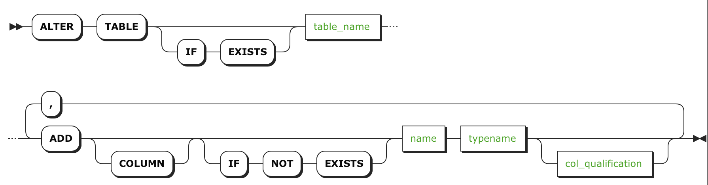

# ADD COLUMN

`ADD COLUMN` [语句](sql-statements.md) 是 `ALTER TABLE` 的一部分，用于向数据表中添加列。

## 简介

## 权限

用户必须对数据表有 `CREATE` 的[权限](privileges.md)。

## 参数

| 参数                  | 描述                                       |
| ------------------- | ---------------------------------------- |
| `table_name`        | 所操作的数据表的表名。                             |
| `name`              | 需要添加的列名。列名必须符合[标识符规则](keywords-and-identifiers.md#identifiers)且在表中是唯一的，但是可以使用唯一的名字作为索引和约束条件。 |
| `typename`          | 新增的列中允许的[数据类型](data-types.md)。       |
| `col_qualification` | 列定义的说明列表，内容包括[列级约束](constraints.md)、[校验](collate.md)、或[列族分配](column-families.md)。  注意不要为列添加[外键](foreign-key.md)约束。一种解决方法是，添加一个没有约束的列，然后使用 [`CREATE INDEX`](create-index.md) 语句为该列添加索引，再用 [`ADD CONSTRAINT`](add-constraint.md) 语句为该列添加外键约束。 |

## 示例

### 插入一列

~~~ sql
> ALTER TABLE accounts ADD COLUMN names STRING;
~~~

~~~ sql
> SHOW COLUMNS FROM accounts;
~~~

~~~
+-----------|-------------------|-------|---------|-----------+
|   Field   |       Type        | Null  | Default |  Indices  |
+-----------|-------------------|-------|---------|-----------+
| id        | INT               | false | NULL    | {primary} |
| balance   | DECIMAL           | true  | NULL    | {}        |
| names     | STRING            | true  | NULL    | {}        |
+-----------|-------------------|-------|---------|-----------+
~~~

### 插入多列

~~~ sql
> ALTER TABLE accounts ADD COLUMN location STRING, ADD COLUMN amount DECIMAL;
~~~

~~~ sql
> SHOW COLUMNS FROM accounts;
~~~

~~~
+-----------|-------------------|-------|---------|-----------+
|   Field   |       Type        | Null  | Default |  Indices  |
+-----------|-------------------|-------|---------|-----------+
| id        | INT               | false | NULL    | {primary} |
| balance   | DECIMAL           | true  | NULL    | {}        |
| names     | STRING            | true  | NULL    | {}        |
| location  | STRING            | true  | NULL    | {}        |
| amount    | DECIMAL           | true  | NULL    | {}        |
+-----------|-------------------|-------|---------|-----------+

~~~

### 插入一个具有默认值的非空列

~~~ sql
> ALTER TABLE accounts ADD COLUMN interest DECIMAL NOT NULL DEFAULT (DECIMAL '1.3');
~~~

~~~ sql
> SHOW COLUMNS FROM accounts;
~~~
~~~
+-----------|-------------------|-------|---------------------------|-----------+
|   Field   |       Type        | Null  |          Default          |  Indices  |
+-----------|-------------------|-------|---------------------------|-----------+
| id        | INT               | false | NULL                      | {primary} |
| balance   | DECIMAL           | true  | NULL                      | {}        |
| names     | STRING            | true  | NULL                      | {}        |
| location  | STRING            | true  | NULL                      | {}        |
| amount    | DECIMAL           | true  | NULL                      | {}        |
| interest  | DECIMAL           | false | ('1.3':::STRING::DECIMAL) | {}        |
+-----------|-------------------|-------|---------------------------|-----------+
~~~

### 插入一个具有唯一值的非空列

~~~ sql
> ALTER TABLE accounts ADD COLUMN cust_number DECIMAL UNIQUE NOT NULL;
~~~

### 插入一个具有校验功能的列

~~~ sql
> ALTER TABLE accounts ADD COLUMN more_names STRING COLLATE en;
~~~

### 插入一列并将其分配给一个列族

#### 插入一列并将其分配给一个新列族
~~~ sql
> ALTER TABLE accounts ADD COLUMN location1 STRING CREATE FAMILY new_family;
~~~

#### 插入一列并将其分配给一个已存在的列族
~~~ sql
> ALTER TABLE accounts ADD COLUMN location2 STRING FAMILY existing_family;
~~~

#### 插入一列并将其分配给一个列族，如果该列族不存在则创建该列族

~~~ sql
> ALTER TABLE accounts ADD COLUMN new_name STRING CREATE IF NOT EXISTS FAMILY f1;
~~~

## 文档查阅
- [`ALTER TABLE`](alter-table.md) 语句
- [列级约束](constraints.md)
- [校验](collate.md)
- [列族](column-families.md)
