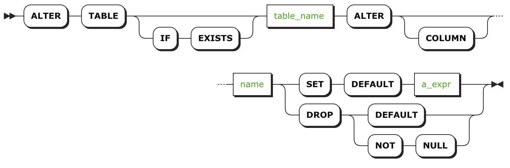

# ALTER COLUMN
使用 `ALTER COLUMN` 语句来改变列的默认约束。

`ALTER COLUMN` [语句](sql-statements.html)是 `ALTER TABLE` 和改变一列的[默认约束](default-value.html)或 drop 掉[非空约束](not-null.html)的一部分。

要管理其它约束，查看 `ADD CONSTRAINT` 和 `DROP CONSTRAINT` 。

## 简介




## 权限

用户必须对数据表有 `CREATE` 的[权限](privileges.html) 。

## 参数

| 参数           | 描述           |
| ------------ | ------------ |
| `table_name` | 想要修改的数据表的名称。 |
| `name`       | 想要修改的列的名称。   |
| `a_expr`     | 想要使用的新默认值。   |

## 示例

### 设置或更改默认值

在将数据写入表时，通过设置[默认值约束](default-value.html)来插入值，而无需显示的定义该列的值。如果该列已经有一个默认值集，可以使用这条语句来更改它。

下面的示例中，在将数据插入到 `subscriptions` 表时，无需定义 `newsletter` 列的值，即可插入布尔值 `true` 。
```sql
ALTER TABLE subscriptions ALTER COLUMN newsletter SET DEFAULT true;
```
### 移除默认约束

如果某列有定义好的[默认值](default-value.html)，可以移除该约束，这意味着如果没有为该列显式的定义值，将不再默认插入值。

``` sql
> ALTER TABLE subscriptions ALTER COLUMN newsletter DROP DEFAULT;
```

### 移除非空约束

如果某列应用了[非空约束](not-null.html)，可以移除该约束，这意味着该列变为可选的，并且可以写入空值。

``` sql
ALTER TABLE subscriptions ALTER COLUMN newsletter DROP NOT NULL;
```

## 参考

- [约束](constraints.html)
- [`ADD CONSTRAINT`](add-constraint.html)
- [`DROP CONSTRAINT`](drop-constraint.html)
- [`ALTER TABLE`](alter-table.html)
