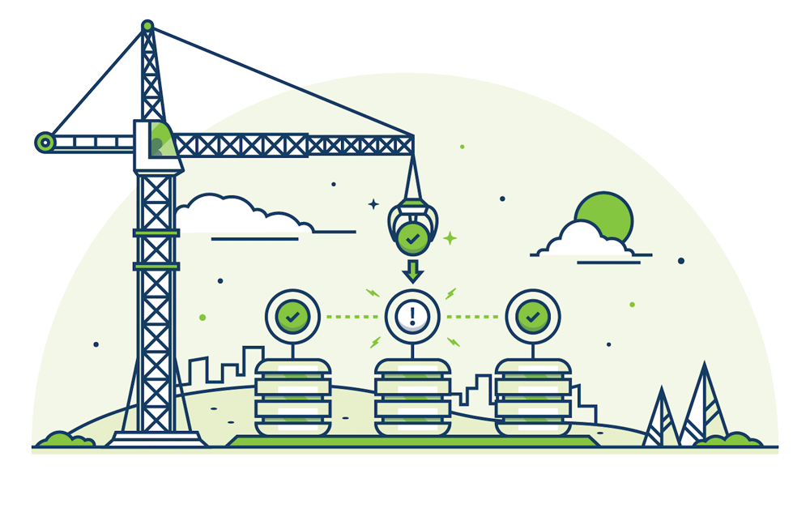

# Automated Scaling & Repair

CockroachDB 以最小的操作员开销横向缩放。你可以在本地计算机、一台服务器、一个公司开发集群，或者是一个私有云或公有云上运行它。[增加容量](start-a-node.md)容易得如同指向运行集群中的一个节点。

在键-值层，CockroachDB 从一个单一的空域开始。随着你加入数据，这个单一域最终达到一个阈值大小（默认为 64M）。当这种情况发生，数据分裂为两个域，每个包含整个键-值空间的一个连续段。这个过程无限持续；当新的数据流入，现有的域继续分裂为新的域，目的是保持相对小和一致的域大小。
 
当你的集群跨多个节点（物理机、虚拟机，或者容器），新分裂的域被自动再平衡到有容量的节点。CockroachDB 使用一个点对点的[闲话协议](https://en.wikipedia.org/wiki/Gossip_protocol)沟通再平衡的机会，通过这个协议，节点交换网络地址、存储容量和其他的信息。

-   增加资源以横向扩展，既不困难也无需停机
-   自组织、自修复和自动再平衡
-   在云之间无缝迁移数据

