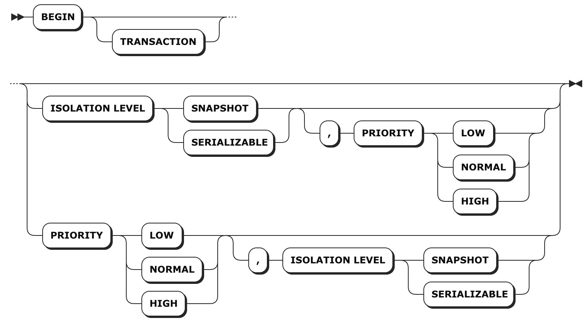

# BEGIN

`BEGIN` [语句](sql-statements.html)启动一个[事务](transactions.html)，它要么成功地执行它包含的所有语句，要么全部不执行。

***警告***

使用事务时，你的应用中应当包含[重试事务](https://www.cockroachlabs.com/docs/stable/transactions.html#transaction-retries)的逻辑，用于中止破坏并发事务之间的依赖关系循环。

## 简介

## 所需权限

启动事务不需要任何[权限](privileges.html)。然而，事务中的每条语句都需要权限。

## 别名

在 CockroachDB 中，以下是 `BEGIN` 语句的别名:

- `BEGIN TRANSACTION`
- `START TRANSACTION`

[隔离级别](transactions.html#isolation-levels)还有以下别名:

- `REPEATABLE READ` 是 `SERIALIZABLE` 的别名。
- `READ UNCOMMITTED` 和 `READ COMMITTED` 是 `SNAPSHOT` 的别名。

有关隔离级别别名的更多信息，请参见 [Comparison to ANSI SQL Isolation Levels](transactions.html#comparison-to-ansi-sql-isolation-levels)。

## 参数

| 参数                | 描述                                       |
| ----------------- | ---------------------------------------- |
| `ISOLATION LEVEL` | 如果不想让事务按 `SERIALIZABLE` 执行（CockroachDB 默认执行的参数，提供隔离的最高级别），你可以指定`SNAPSHOT` 参数，它可以在高争用情况下提供更好的性能。更多信息请参见 [Transactions: Isolation Levels](transactions.html#isolation-levels)。**默认参数**：`SERIALIZABLE` |
| `PRIORITY`        | 如果你不希望事务按照 `NORMAL` 优先级运行，可以将其设置为 `LOW` 或 `HIGH`。具有更高优先级的事务不太可能需要重试。更多信息请参见 [Transactions: Priorities](transactions.html#transaction-priorities)。**默认参数**: `NORMAL` |

## 示例

### 启动一个事务

#### 使用默认设置

如果不修改 `BEGIN` 语句，事务将使用 `SERIALIZABLE` 隔离和 `NORMAL` 优先级。

~~~ sql
> BEGIN;

> SAVEPOINT cockroach_restart;

> UPDATE products SET inventory = 0 WHERE sku = '8675309';

> INSERT INTO orders (customer, sku, status) VALUES (1001, '8675309', 'new');

> RELEASE SAVEPOINT cockroach_restart;

> COMMIT;
~~~

***警告***

这个例子假定你在使用[客户端干预处理事务重试](http://transactions.html/#client-side-intervention)。

#### 更改隔离级别和优先级

可以将事务的隔离界别设置为 `SNAPSHOT`， 并将其优先级设置为 `LOW` 或 `HIGH`。

~~~ sql
> BEGIN ISOLATION LEVEL SNAPSHOT, PRIORITY HIGH;

> SAVEPOINT cockroach_restart;

> UPDATE products SET inventory = 0 WHERE sku = '8675309';

> INSERT INTO orders (customer, sku, status) VALUES (1001, '8675309', 'new');

> RELEASE SAVEPOINT cockroach_restart;

> COMMIT;
~~~

也可以将事务隔离级别和优先级设置为 [`SET TRANSACTION`](set-transaction.html)。

***警告***

这个例子假定你在使用[客户端干预处理事务重试](http://transactions.html/#client-side-intervention)。

### 启动一个带有自动重试的事务

CockroachDB 将[自动重试](transactions.html#transaction-retries)在同一批中同时包含 `BEGIN` 和 `COMMIT` 的所有事务。批处理由您的驱动程序或客户端的行为约束，但这意味着 CockroachDB 将所有语句作为一个单元接收，而不是多条请求。

从 CockroachDB 视角来看，作为批发送的事务如下所示：

~~~ sql
> BEGIN; DELETE FROM customers WHERE id = 1; DELETE orders WHERE customer = 1; COMMIT;
~~~

然而，在你应用的代码中，批量事务通常仅仅是单次发送多条语句。例如，在 Go 中，此事务将作为单个批次发送（以及自动重试）：

~~~ go
db.Exec(
  "BEGIN;

  DELETE FROM customers WHERE id = 1;

  DELETE orders WHERE customer = 1;

  COMMIT;"
)
~~~

以这种方式发送语句意味着，如果事务没有立即成功，CockroachDB 不需要更改语句的任何值，因此它可以继续重试该事务直到成功为止。

## 参考

- [事务](transactions.html)
- [`COMMIT`](commit-transaction.html)
- [`SAVEPOINT`](savepoint.html)
- [`RELEASE SAVEPOINT`](release-savepoint.html)
- [`ROLLBACK`](rollback-transaction.html)
