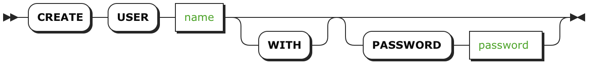

# CREATE USER

`CREATE USER` [语句](sql-statements.html)创建 SQL 用户，它可以让你控制数据库和表的[权限](privileges.html)。

创建用户时，以下几点非常重要：

- 用户名是区分大小写的；必须以字母或下划线开始；必须只包含字母、数字或下划线；并且必须是 1 到 63 个字符之间。
- 创建用户后，必须[授予它们对数据库和表的访问权限](grant.html)。
- 在安全集群上，用户必须[验证它们对集群的访问权限](user-authentication)。

***警告***

你也可以通过 [cockroach user](https://www.cockroachlabs.com/docs/stable/create-and-manage-users.html) 命令创建并管理用户。值得注意的是，这是[移除用户](http://create-and-manage-users.html/#remove-a-user)最有效的方式。

## 所需权限

用户必须具有对 `system.users` 表的 `INSERT` 和 `UPDATE` [权限](privileges.html)。

## 简介

## 参数

| 参数         | 描述                                       |
| ---------- | ---------------------------------------- |
| `name`     | 要创建的用户的名称。用户名是区分大小写的；必须以字母或下划线开始；必须只包含字母、数字或下划线；并且必须是 1 到 63 个字符之间。 |
| `password` | 让用户用此密码来[验证它们对加密集群的访问权](#user-authentication)。密码必须以用单引号 (`'`) 包围的[字符串](string.html)值输入。 |

## 用户认证

安全集群要求用户验证其对数据库和表的访问权。CockroachDB 为此提供了两种方式：

- [客户端证书和密钥认证](#secure-clusters-with-client-certificates)，可供所用用户使用。为了确保最高级别的安全性，我们建议只使用客户端证书和密钥身份认证。

- [密码认证](#secure-clusters-with-passwords)，只适用于你为它创建过密码的用户。要创建一个带有密码的用户，使用 `CREATE USER` 的 `WITH PASSWORD` 子句。

  你可以使用这个密码来认证用户而无需提供它们的客户端证书和密钥；然而，我们建议尽可能的使用客户端证书和密钥认证。

  若要向现有用户添加密码，请使用 [`cockroach user` 命令](create-and-manage-users.html#update-a-users-password)。

  ***警告***

不安全的集群不支持用户认证，但是你仍可以通过 `WITH PASSWORD` 子句为用户创建密码（除了 `root` 用户）。

## 示例

### 创建用户

~~~ sql
> CREATE USER jpointsman;
~~~

用户名是区分大小写的；必须以字母或下划线开始；必须只包含字母、数字或下划线；并且必须是 1 到 63 个字符之间。

创建用户后，必须[授予它们对数据库和表的访问权限](grant.html)。

对于安全集群上的用户来说，也需要生成[客户端证书和密钥](create-security-certificates.html#create-the-certificate-and-key-pair-for-a-client)来认证用户对集群的访问权。

### 创建具有密码身份验证的用户

~~~ sql
> CREATE USER jpointsman WITH PASSWORD 'Q7gc8rEdS';
~~~

***警告***

我们强烈建议创建[客户端证书和密钥](create-security-certificates.html)，并且使用它们来[认证用户对集群的访问权](#secure-clusters-with-client-certificates)。

### 管理用户

创建用户后，可以使用 [`cockroach user`](create-and-manage-users.html) 命令来管理它们。

### 作为特定用户进行认证

#### 非安全集群

~~~ shell
$ cockroach sql --user=jpointsman
~~~

#### 带有客户端证书的安全集群

所有用户都可以使用发布给其用户名的[客户端证书](create-security-certificates.html#create-the-certificate-and-key-pair-for-a-client)来认证它们对安全集群的访问权。

~~~ shell
$ cockroach sql --user=jpointsman
~~~

#### 带有密码的安全集群

[有密码的用户](#create-a-user-with-password-authentication)可以在命令提示符下输入密码，而不是使用客户机证书和密钥来验证他们的访问权限。

~~~ shell
$ cockroach sql --user=jpointsman
~~~

## 参考

- [`cockroach user` 命令](create-and-manage-users.html)
- [`SHOW USERS`](show-users.html)
- [`GRANT`](grant.html)
- [`SHOW GRANTS`](show-grants.html)
- [创建安全证书](create-security-certificates.html)
- [其它 SQL 语句](sql-statements.html)
