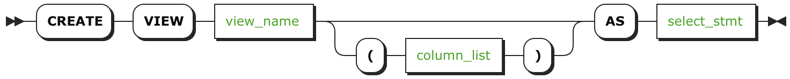

# CREATE VIEW

`CREATE VIEW` 语句创建一个新的 [view](views.html)，它是一个表示为虚拟表的存储的 `SELECT` 查询。

## 所需权限

用户必须有对父数据库的 `CREATE` 权限，并且在任何被此视图引用的表上有 `SELECT` 权限。

## 介绍

## 参数

| 参数               | 描述                                       |
| ---------------- | ---------------------------------------- |
| `view_name`      | 要创建的视图的名称，在其所在的数据库里面它必须是唯一的，并且遵循这些[标识符规则](keywords-and-identifiers.html#identifiers)。当默认数据库不是父数据库时，名字必须格式化为 `database.name`。 |
| `column_list`    | 一个可选的，视图的列名称以逗号分隔的列表。如果指定，这些名称将被用于响应，而不是在 `AS select_stmt` 中指定的列。 |
| `AS select_stmt` | 当请求视图时执行的 `SELECT` 语句。需要注意的是，目前不可能使用 `*` 从引用的表或视图中选择所有列，相反，必须指定特定的列。 |

## 示例

***警告***

这个例子强调了使用视图的一个关键好处：简化复杂的查询。更多额外的好处和示例，请查看[views](views.html)。

假定你正在使用 [sample `startrek` database](generate-cockroachdb-resources.html#generate-example-data)，它包含两个表，`episodes` 和 `quotes`。在 `episodes.id` 列和 `quotes.episode` 列之间有外键限制。要对每一季著名语录的数量计数，可以运行下面的 `JOIN`：

~~~ sql
> SELECT startrek.episodes.season, count(*)
  FROM startrek.quotes
  JOIN startrek.episodes
  ON startrek.quotes.episode = startrek.episodes.id
  GROUP BY startrek.episodes.season;
~~~

~~~
+--------+----------+
| season | count(*) |
+--------+----------+
|      2 |       76 |
|      3 |       46 |
|      1 |       78 |
+--------+----------+
(3 rows)
~~~

或者，为了更简单的运行这个复杂的查询，可以创建一个视图：

~~~ sql
> CREATE VIEW startrek.quotes_per_season (season, quotes)
  AS SELECT startrek.episodes.season, count(*)
  FROM startrek.quotes
  JOIN startrek.episodes
  ON startrek.quotes.episode = startrek.episodes.id
  GROUP BY startrek.episodes.season;
~~~

~~~
CREATE VIEW
~~~

然后视图与数据库中其它表一起表示为虚拟表：

~~~ sql
> SHOW TABLES FROM startrek;
~~~

~~~
+-------------------+
|       Table       |
+-------------------+
| episodes          |
| quotes            |
| quotes_per_season |
+-------------------+
(4 rows)
~~~

执行此查询就像从视图中 `SELECT` 一样简单，就像你从标准表中所做的那样：

~~~ sql
> SELECT * FROM startrek.quotes_per_season;
~~~

~~~
+--------+--------+
| season | quotes |
+--------+--------+
|      2 |     76 |
|      3 |     46 |
|      1 |     78 |
+--------+--------+
(3 rows)
~~~

## 参考

- [Views](views.html)
- [`SHOW CREATE VIEW`](show-create-view.html)
- [`ALTER VIEW`](alter-view.html)
- [`DROP VIEW`](drop-view.html)
