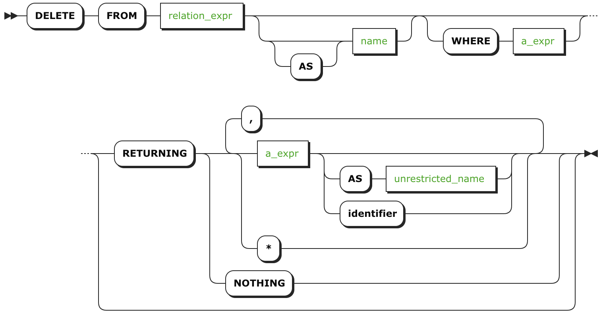

# DELETE

`DELETE` [语句](sql-statements.html) 从表中删除行。

***警告***

要删除列，请查看 [`DROP COLUMN`](https://www.cockroachlabs.com/docs/stable/drop-column.html)。

## 所需权限

用户必须具有对表的 `DELETE` 和 `SELECT` [权限](privileges.html) 。

## 简介

## 参数

| 参数              | 描述                                       |
| --------------- | ---------------------------------------- |
| `relation_expr` | 要删除行的表的名称。不支持用一条语句从多个表中删除。               |
| `AS name`       | Alia为表创建别名，完全隐藏其原始名称。表的所有后续引用都必须使用其别名。别名主要和 `JOIN` 一起使用，这还没有得到支持，但会在[未来的版本](https://github.com/cockroachdb/cockroach/issues/2970)中发布。 |
| `WHERE a_expr`  | `a_expr` 必须是使用列（例如 `<column> = <value>`）返回布尔值的表达式。删除返回 `TRUE` 的行。__语句中如果没有 `WHERE` 子句，`DELETE` 将删除表的所有列。__ |
| `RETURNING ...` | 使用 [all columns](https://www.cockroachlabs.com/docs/stable/delete.html#use-all-columns) (`*`) 或 [specific columns](https://www.cockroachlabs.com/docs/stable/delete.html#use-specific-columns) (named in `a_expr`) 来检索删除列的表。在应答中不返回任何内容，甚至不影响行数，使用 `RETURNING NOTHING`。 |
| `AS col_label`  | 在检索到的表中，将列标签从  `a_expr` 更改为 `col_label`。也可以用 `identifier` 更改列标签，但必须遵守[这些规则](keywords-and-identifiers.html#identifiers)。 |

## 成功的应答

| 应答               | 描述                                       |
| ---------------- | ---------------------------------------- |
| `DELETE` _`int`_ | int 行被删除。没有删除任何行的 `DELETE` 语句应答为 `DELETE 0`。当使用 `RETURNING NOTHING` 时，应答中不包含这条信息。 |
| Retrieved table  | 包括 `RETURNING` 子句来检索已删除的行，通过子句的参数来使用所标识的列。[看一个例子](#return-deleted-rows)。 |

## 示例

### 删除所用行

可以通过在使用 `DELETE` 语句时不包含 `WHERE` 子句来删除表中的所有行。

~~~ sql
> DELETE FROM account_details;
~~~
~~~
DELETE 7
~~~

这条语句大致相当于  [`TRUNCATE`](truncate.html)。

~~~
> TRUNCATE account_details;
~~~
~~~
TRUNCATE
~~~

如你所见，有一点不同的是 `TRUNCATE` 不返回它所删除行的数量。

### 删除特定行

当删除表中的特定行时，你做出的最重要的决定是在 `WHERE` 子句中使用哪些列。做出选择时，考虑在使用带有 [Primary Key](primary-key.html)/[Unique](unique.html) 约束（两者都强调唯一性）的列时对那些非唯一列的潜在影响。

#### 使用 Primary Key/Unique 列删除行

使用带有 [Primary Key](primary-key.html)/[Unique](unique.html) 约束的列来删除行确保了你的语句是明确的——没有两行会包含相同的列值，所以这是不太可能无意中删除数据的。

这个例子中，`account_id` 是我们的主键，并且我们想删除等于 1 的行。因为我们确定在 `account_id` 列中没有其它行有那个值，没有意外删除其它行的风险。

~~~ sql
> DELETE FROM account_details WHERE account_id = 1 RETURNING *;
~~~
~~~
+------------+---------+--------------+
| account_id | balance | account_type |
+------------+---------+--------------+
|          1 |   32000 | Savings      |
+------------+---------+--------------+
~~~

#### 删除使用非唯一列的行

删除使用非唯一列的行时，为 `WHERE` 子句的 `a_expr` 返回 `TRUE` 的每一行都会被删除。这很容易导致删除你不打算删除的数据。

~~~ sql
> DELETE FROM account_details WHERE balance = 30000 RETURNING *;
~~~
~~~
+------------+---------+--------------+
| account_id | balance | account_type |
+------------+---------+--------------+
|          2 |   30000 | Checking     |
|          3 |   30000 | Savings      |
+------------+---------+--------------+
~~~

示例语句删除了两行，这可能是不期望的。

### 返回以删除的行

要查看你的语句删除了哪些行，可以用指定的列中包含 `RETURNING` 子句来检索它们。

#### 使用所有列
通过指定 `*`，检索删除行的所有列。

~~~ sql
> DELETE FROM account_details WHERE balance < 23000 RETURNING *;
~~~
~~~
+------------+---------+--------------+
| account_id | balance | account_type |
+------------+---------+--------------+
|          4 |   22000 | Savings      |
+------------+---------+--------------+
~~~

#### 使用特定列

要检索特定列，在 `RETURNING` 子句中给它们命名。

~~~ sql
> DELETE FROM account_details WHERE account_id = 5 RETURNING account_id, account_type;
~~~
~~~
+------------+--------------+
| account_id | account_type |
+------------+--------------+
|          5 | Checking     |
+------------+--------------+
~~~

#### 更改列标签

当 `RETURNING` 指定列时，可以使用 `AS` 来更改它们的标签。

~~~ sql
> DELETE FROM account_details WHERE balance < 22500 RETURNING account_id, balance AS final_balance;
~~~
~~~
+------------+---------------+
| account_id | final_balance |
+------------+---------------+
|          6 |         23500 |
+------------+---------------+
~~~

## 参考

- [`INSERT`](insert.html)
- [`TRUNCATE`](truncate.html)
- [`ALTER TABLE`](alter-table.html)
- [`DROP TABLE`](drop-table.html)
- [`DROP DATABASE`](drop-database.html)
- [Other SQL Statements](sql-statements.html)
