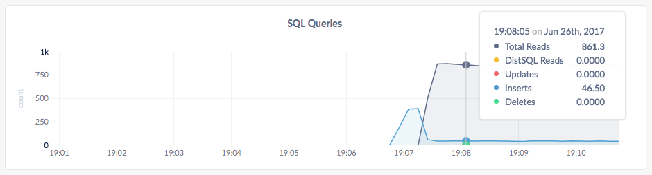
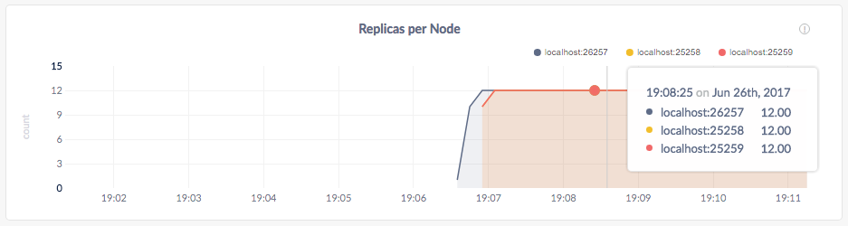
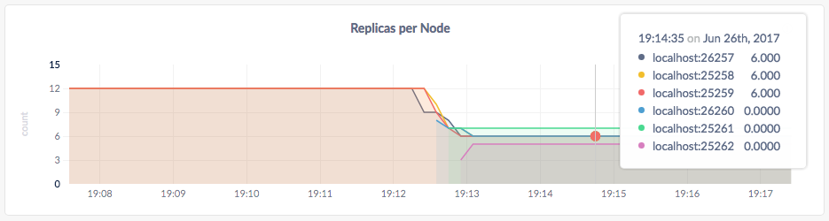
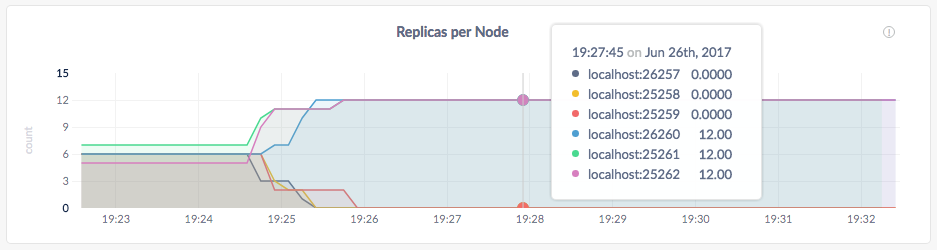

# Cross-Cloud Deployment & Migration

提要：使用一个本地的集群模拟从一个云平台迁移到另一个云平台。

CockroachDB 灵活的[复制控制](configure-replication-zones.md)，使得跨云平台运行一个单一 CockroachDB 集群和从一个云迁移数据到另一个云而不中断服务极其容易。

## 看一段现场演示

https://www.youtube.com/embed/cCJkgZy6s2Q

## 第一步：安装需要的软件

在本教程中，将使用 CockroachDB、HAProxy 负载均衡器和 CockroachDB 版的 YCSB 负载生成器，后者需要 Go。在开始之前，确保安装了这些应用程序：

- 安装最新版本的 [CockroachDB](install-cockroachdb.md)。
- 安装 [HAProxy](http://www.haproxy.org/)。如果你使用 Mac 和 Homebrew，运行 `brew install haproxy`。
- 安装 [Go](https://golang.org/dl/)。如果你使用 Mac 和 Homebrew，运行 `brew install go`。
- 安装 [CockroachDB 版的 YCSB](https://github.com/cockroachdb/loadgen/tree/master/ycsb)：`go get github.com/cockroachdb/loadgen/ycsb`。

另外，为了保存用于集群的数据文件和日志，你看你要创建一个新目录（即，`mkdir cloud-migration`）并在此目录中启动你所有的节点。

## 第二步：在“云 1”上启动一个三节点的集群

如果你已经[启动了一个本地集群](start-a-local-cluster.md)，一个熟悉启动节点的命令。新的需要注意的选项是 [`--locality`](configure-replication-zones.md#descriptive-attributes-assigned-to-nodes)，它接受描述一个节点地形的键值对，在这种情况下，你使用标志指定前三个节点运行在云 1 上。

在一个新的终端窗口中，在云 1 上启动节点 1：

~~~ shell
$ cockroach start --insecure \
--locality=cloud=1 \
--store=cloud1node1 \
--host=localhost \
--cache=100MB
~~~~

在一个新的终端窗口中，在云 1 上启动节点 2：

~~~ shell
$ cockroach start --insecure \
--locality=cloud=1 \
--store=cloud1node2 \
--host=localhost \
--port=25258 \
--http-port=8081 \
--join=localhost:26257 \
--cache=100MB
~~~

在一个新的终端窗口中，在云 1 上启动节点 3：

~~~ shell
$ cockroach start --insecure \
--locality=cloud=1 \
--store=cloud1node3 \
--host=localhost \
--port=25259 \
--http-port=8082 \
--join=localhost:26257 \
--cache=100MB
~~~

## 第三步：设置 HAProxy 负载均衡

现在，你在一个模拟的云上运行三个节点。每个节点你的集群的同等合适的 SQL 网关，但是为了确保在这些节点间客户端请求的均衡，可以使用一个 TCP 负载均衡器。使用前面安装的开源 [HAProxy](http://www.haproxy.org/) 负载均衡器。

在一个新的终端窗口中，运行 [`cockroach gen haproxy`](generate-cockroachdb-resources.md) 命令，指定所有节点的端口：

~~~ shell
$ cockroach gen haproxy --insecure --host=localhost --port=26257
~~~

这条命令生成一个 `haproxy.cfg` 文件，被自动配置为与你正在运行的集群的三个节点工作。在这个文件中，将 `bind :26257` 修改为 `bind :26000`。这修改了 HAProxy 接受请求的端口为不被节点使用的端口，并且不会被你将随后添加的节点使用。

~~~
global
  maxconn 4096

defaults
    mode                tcp
    timeout connect     10s
    timeout client      1m
    timeout server      1m

listen psql
    bind :26000
    mode tcp
    balance roundrobin
    server cockroach1 localhost:26257
    server cockroach2 localhost:26258
    server cockroach3 localhost:26259
~~~

启动 HAProxy，使用 `-f` 标志指向 `haproxy.cfg` 文件：

~~~ shell
$ haproxy -f haproxy.cfg
~~~

## 第四步：启动一个负载生成器

现在，你有了一个运行在你的集群前面的负载均衡器，来使用你前面安装的 YCSB 负载生成器模拟多个客户端连接，每个执行混合的读/写工作负载。

在一个新的终端窗口中，启动 `ycsb`，将其指向 HAProxy 的端口：

~~~ shell
$ $HOME/go/bin/ycsb -duration 20m -tolerate-errors -concurrency 10 -rate-limit 100 'postgresql://root@localhost:26000?sslmode=disable'
~~~

这条命令发起了 10 个并发客户端工作负载，持续 20 分钟，但限制每个工作者为每秒 100 个操作（因为你在一台机器上运行所有的东西）。

## 第五步：观察所有三个节点上的数据平衡

现在，打开 Admin UI `http://localhost:8080` 并将光标悬停在顶部的 **SQL Queries** 上。一分钟所有之后，你将看到负载生成器正在跨所有的节点执行大约 95% 的读和 5% 的写操作：

向下滚动一点并悬停在 **Replicas per Node** 图上。因为 CockroachDB 默认复制每段数据三次，三个节点中每个节点上的副本数量应该是一样的：

## 第六步：添加三个节点到“云 2”

在这一点上，你在云 1 上运行三个节点。但是，如果你想开始试验由另一个云供应商提供的资源呢？我们来试试，添加三个更多的节点到一个新的云平台。这次，要注意的标志是 [`--locality`](configure-replication-zones.md#descriptive-attributes-assigned-to-nodes)，你在使用它指定后面的三个节点运行在云 2 上。

在一个新的终端窗口中，在云 2 上启动节点 4：

~~~ shell
$ cockroach start --insecure \
--locality=cloud=2 \
--store=cloud2node4 \
--host=localhost \
--port=26260 \
--http-port=8083 \
--join=localhost:26257 \
--cache=100MB
~~~
在一个新的终端窗口中，在云 2 上启动节点 5：

~~~ shell
$ cockroach start --insecure \
--locality=cloud=2 \
--store=cloud2node5 \
--host=localhost \
--port=25261 \
--http-port=8084 \
--join=localhost:26257 \
--cache=100MB
~~~

在一个新的终端窗口中，在云 2 上启动节点 6：

~~~ shell
$ cockroach start --insecure \
--locality=cloud=2 \
--store=cloud2node6 \
--host=localhost \
--port=25262 \
--http-port=8085 \
--join=localhost:26257 \
--cache=100MB
~~~

## 第七步：观察所有六个节点上的数据平衡

回到 Admin UI，再次将光标悬停在 **Replicas per Node** 图上。因为你使用了  [`--locality`](configure-replication-zones.md#descriptive-attributes-assigned-to-nodes) 指定节点运行在云 2 上，你将看到每个节点上是大约平均的副本数，这意味着 CockroachDB 已经自动在两个模拟的云上再平衡了副本：

注意，Admin UI 需要花几分钟在光标悬停时显示每个节点的准确副本数。这是在上面的截屏中新的节点显示 0 个副本的原因。然而，图线是准确的，而且你也可以点击 **Summary** 区的 **View node list**，获得每个节点的准确副本数。

## 第八步：将所有数据迁移到“云 2”

所以，你的集群跨两个模拟的云复制了。但是，假设在实验之后，你喜欢云供应商 2，而且决定迁移所有的节点到那里。你能够在不中断你的运行中的客户端的流量做到吗？是的，而且就是简单地运行一条命令，用 `--locality=cloud=2` 添加一个[硬限制](configure-replication-zones.md#replication-constraints)所有的副本必须在节点上。
在一个新的终端窗口中，编辑默认的复制区：

~~~ shell
$ echo 'constraints: [+cloud=2]' | cockroach zone set .default --insecure --host=localhost -f -
~~~

## 第九步：验证数据迁移

回到 Admin UI，再次悬停在 **Replicas per Node** 图上，很快，你将看到节点 4, 5,  6 上的副本数加倍，而节点 1, 2, 3 上的副本数变为0：

这表示所有数据已经从云 1 迁移到了云 2。在一个真实的云迁移场景中，在这一点，你应该更新负载均衡器指向在云 2 上的节点并停止云 1 上的节点。但出于这个本地模拟的目的，不需要这样做。

## 第十步：停止集群

一旦你用完了集群， 切换到 YCSB 的终端窗口并按 **CTRL + C** 键停止它。然后，用同样的方法停止 HAProxy 和每个 CockroachDB 节点。

> 提示：
> 
> 对于最后一个节点，停机的时间会长一点（大约一分钟）并将最终强制杀掉节点。这是因为，在只有一个节点还在线时，大部分副本（三个中的两个）不再可用，所以集群不再运行。为了加速这一过程，再次按 <strong>CTRL + C</strong> 键。

如果你不准备重启集群，你可以移除节点的数据存储和 HAProxy 配种文件：

~~~ shell
$ rm -rf cloud1node1 cloud1node2 cloud1node3 cloud2node4 cloud2node5 cloud2node6 haproxy.cfg
~~~

## 下一步

使用一个本地集群模拟其他的 CockroachDB 核心功能：

- [数据复制](demo-data-replication.md)
- [容错与恢复 Tolerance & Recovery](demo-fault-tolerance-and-recovery.md)
- [自动再平衡](demo-automatic-rebalancing.md)

你可能还想学习控制一个集群中副本的位置和数量的其他方式：

- [跨数据中心均衡复制](configure-replication-zones.md#even-replication-across-datacenters)
- [多个应用写入不同的数据库](configure-replication-zones.md#multiple-applications-writing-to-different-databases)
- [对一个特定表的更严格复制](configure-replication-zones.md#stricter-replication-for-a-specific-table)
- [调整系统域的复制](configure-replication-zones.md#tweaking-the-replication-of-system-ranges)
