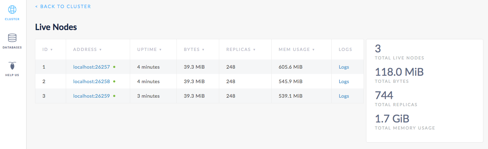
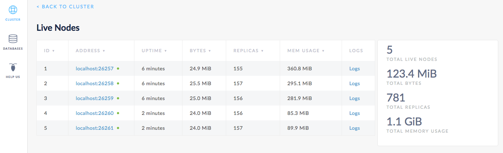

# 自动再平衡

本页介绍了一个简单的例子，CockroachDB 如何在扩展集群的时候自动再平衡数据。从一个三个节点的本地集群开始，降低一个单一域的最大尺寸，即在 CockroachDB 中数据复制的单元。下载并运行 `block_writer` 例子程序，它连续插入数据到你的集群，并观察在域分裂的时候，副本的数量快速增加。然后，添加两个节点，并观察 CockroachDB 如何自动再平衡副本，以有效使用所有可用的容量。

## 准备

在本教程中，将使用一个 Go 程序快速插入数据到一个 CockroachDB 集群。运行这个例子程序，必须有一个 Go 1.7.1 64 位 [环境](http://golang.org/doc/code.html)。

- 可以直接从官网下载 [Go 二进制文件](http://golang.org/doc/code.html)。
- 确保按照[这里](https://golang.org/doc/code.html#GOPATH)描述的，设置 `$GOPATH` 和 `$PATH` 环境变量。

## 第一步：启动一个三节点集群

> 提示：

> 更多<code>CockroachDB 启动</code> 选项的细节，见[启动一个本地集群](start-a-local-cluster.md)。

~~~ shell
# In a new terminal, start node 1:
$ cockroach start --insecure \
--store=scale-node1 \
--host=localhost

# In a new terminal, start node 2:
$ cockroach start --insecure \
--store=scale-node2 \
--host=localhost \
--port=26258 \
--http-port=8081 \
--join=localhost:26257

# In a new terminal, start node 3:
$ cockroach start --insecure \
--store=scale-node3 \
--host=localhost \
--port=26259 \
--http-port=8082 \
--join=localhost:26257
~~~

在一个新的终端窗口中，连接[内建的 SQL shell](use-the-built-in-sql-client.md)  到任意节点，以验证集群在运行：

~~~ shell
$ cockroach sql --insecure
# Welcome to the cockroach SQL interface.
# All statements must be terminated by a semicolon.
# To exit: CTRL + D.
~~~

~~~ sql
> SHOW DATABASES;
~~~

~~~
+--------------------+
|      Database      |
+--------------------+
| crdb_internal      |
| information_schema |
| pg_catalog         |
| system             |
+--------------------+
(4 rows)
~~~

退出 SQL shell：

~~~ sql
> \q
~~~

## 第二步：减小域最大尺寸

在 CockroachDB 中，你使用[复制区](configure-replication-zones.md)控制副本的数量和位置。开始时，整个集群有一个单个的默认复制区，被设置为复制每个数据域三次。这个默认的复制因子对于这个演示很好。

然而，默认复制区也定义了一个数据域大小为多少时被分裂为两个。由于你想快速创建很多域并看到 CockroachDB 如何自动平衡它们，将最大域尺寸从默认的 67108864 字节 (64MB) 减小，会让域更快地分裂：

~~~ shell
$ echo -e "range_min_bytes: 1\nrange_max_bytes: 262144" | cockroach zone set .default --insecure -f -
~~~

~~~
range_min_bytes: 1
range_max_bytes: 262144
gc:
  ttlseconds: 86400
num_replicas: 3
constraints: []
~~~

## 第三步：下载并运行 `block_writer` 程序

CockroachDB 提供了一组 [Go 的例子程序](https://github.com/cockroachdb/examples-go)，用于模拟客户端负载。你将使用的程序被称为 [`block_writer`](https://github.com/cockroachdb/examples-go/tree/master/block_writer)。 它会模拟多个客户端，插入数据到集群。

下载并按照该程序：

~~~ shell
$ go get github.com/cockroachdb/examples-go/block_writer
~~~

运行该程序一分钟，时长足够产生大量的域：

~~~ shell
$ block_writer -duration 1m
~~~

一旦开始运行，`block_writer` 将输出每秒写入的行数：

~~~ shell
 1s:  776.7/sec   776.7/sec
 2s:  696.3/sec   736.7/sec
 3s:  659.9/sec   711.1/sec
 4s:  557.4/sec   672.6/sec
 5s:  485.0/sec   635.1/sec
 6s:  563.5/sec   623.2/sec
 7s:  725.2/sec   637.7/sec
 8s:  779.2/sec   655.4/sec
 9s:  859.0/sec   678.0/sec
10s:  960.4/sec   706.1/sec
~~~

## 第四步：观察副本数量的增加

打开 Admin UI `http://localhost:8080`，点击右侧的 **View nodes list**，随着 `block_writer` 插入数据，你将看到字节数、副本数，和其他的数值a增加。

## 第五步：添加两个节点

增加容量就是简单地启动更多的节点并将它们加入运行的集群：

~~~ shell
# In a new terminal, start node 4:
$ cockroach start --insecure \
--store=scale-node4 \
--host=localhost \
--port=26260 \
--http-port=8083 \
--join=localhost:26257

# In a new terminal, start node 5:
$ cockroach start --insecure \
--store=scale-node5 \
--host=localhost \
--port=26261 \
--http-port=8084 \
--join=localhost:26257
~~~

## 第六步：观察在五个节点间的数据再平衡

回到 Admin UI，你讲看到现在列出的五个节点。首先，节点 4 和 5 的字节数和副本数较低。然而，很快，你将看到这些数值在所有节点上是均匀的，表示数据已经被自动再平衡，以利用增加的新节点容量。

## 第七步：停止集群

一旦你完成了集群测试，到每个节点的终端并按 **CTRL + C** 键，停止它们。

> 提示：

>对于最后一个节点，关机过程会长一些（大约一分钟）并将最终杀掉这个节点。这是因为，只有一个节点在线，多少副本不可用（三个中的两个），因此，集群不能运行。为了加速这个过程，第二次按 <strong>CTRL + C</strong> 键。

如果你不计划重启集群，你可以删除节点的数据存储：

~~~ shell
$ rm -rf scale-node1 scale-node2 scale-node3 scale-node4 scale-node5
~~~

## 下一步

使用一个本地集群探索下列其他的 CockroachDB 核心功能：

- [数据复制](demo-data-replication.md)
- [容错和恢复](demo-fault-tolerance-and-recovery.md)
- [自动云迁移](demo-automatic-cloud-migration.md)
