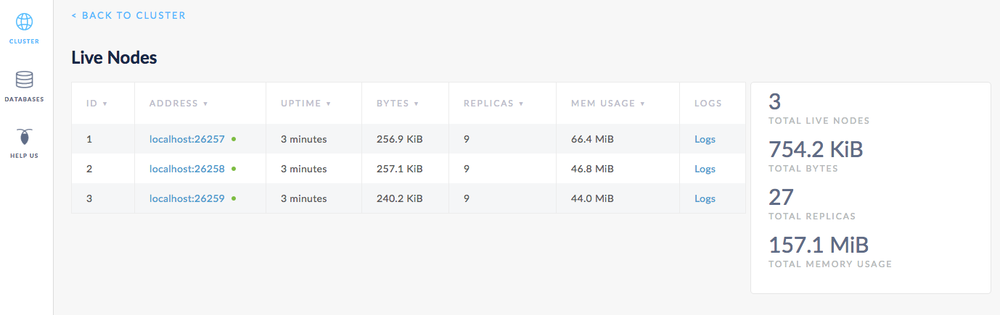

# 数据复制

本页将向你介绍 CockroachDB 如何复制及分配数据的一个简单实例。首先，启动一个单节点本地集群，写入一些数据，添加两个节点，观察数据是如何自动复制的。然后，更新集群让它复制 5 次，添加另外两个节点，并再次观察所有已经存在的复本是如何到新节点的。

## 准备

确保你已经 [安装了 CockroachDB](install-cockroachdb.md)。

## 第一步：启动一个单节点集群

```shell
$ cockroach start --insecure \
--store=repdemo-node1 \
--host=localhost
```

## 第二步：写入数据

在一个新的终端窗口中，使用 [`cockroach gen`](generate-cockroachdb-resources.md) 命令生成一个例子数据库 `intro`：

```shell
$ cockroach gen example-data intro | cockroach sql --insecure
```

```sql
CREATE DATABASE
SET
DROP TABLE
CREATE TABLE
INSERT 1
INSERT 1
INSERT 1
INSERT 1
...
```

在同一个终端窗口中，打开 [内建的 SQL shell](use-the-built-in-sql-client.md)，核实新的数据库 `intro` 已经创建并有一个表 `mytable`：

```shell
$ cockroach sql --insecure
```

```
# Welcome to the cockroach SQL interface.
# All statements must be terminated by a semicolon.
# To exit: CTRL + D.
```

```sql
> SHOW DATABASES;
```

```
+--------------------+
|      Database      |
+--------------------+
| information_schema |
| pg_catalog         |
| intro              |
| system             |
+--------------------+
(4 rows)
```

```sql
> SHOW TABLES FROM intro;
```

```
+---------+
|  Table  |
+---------+
| mytable |
+---------+
(1 row)
```

```sql
> SELECT * FROM intro.mytable WHERE (l % 2) = 0;
```

```
+----+-----------------------------------------------------+
| l  |                          v                          |
+----+-----------------------------------------------------+
|  0 | !__aaawwmqmqmwwwaas,,_        .__aaawwwmqmqmwwaaa,, |
|  2 | !"VT?!"""^~~^"""??T$Wmqaa,_auqmWBT?!"""^~~^^""??YV^ |
|  4 | !                    "?##mW##?"-                    |
|  6 | !  C O N G R A T S  _am#Z??A#ma,           Y        |
|  8 | !                 _ummY"    "9#ma,       A          |
| 10 | !                vm#Z(        )Xmms    Y            |
| 12 | !              .j####mmm#####mm#m##6.               |
| 14 | !   W O W !    jmm###mm######m#mmm##6               |
| 16 | !             ]#me*Xm#m#mm##m#m##SX##c              |
| 18 | !             dm#||+*$##m#mm#m#Svvn##m              |
| 20 | !            :mmE=|+||S##m##m#1nvnnX##;     A       |
| 22 | !            :m#h+|+++=Xmm#m#1nvnnvdmm;     M       |
| 24 | ! Y           $#m>+|+|||##m#1nvnnnnmm#      A       |
| 26 | !  O          ]##z+|+|+|3#mEnnnnvnd##f      Z       |
| 28 | !   U  D       4##c|+|+|]m#kvnvnno##P       E       |
| 30 | !       I       4#ma+|++]mmhvnnvq##P`       !       |
| 32 | !        D I     ?$#q%+|dmmmvnnm##!                 |
| 34 | !           T     -4##wu#mm#pw##7'                  |
| 36 | !                   -?$##m####Y'                    |
| 38 | !             !!       "Y##Y"-                      |
| 40 | !                                                   |
+----+-----------------------------------------------------+
(21 rows)
```

然后退出 SQL shell：

```sql
> \q
```

## 第三步：添加两个节点

在一个新的终端窗口中，添加节点 2：

```shell
$ cockroach start --insecure \
--store=repdemo-node2 \
--host=localhost \
--port=26258 \
--http-port=8081 \
--join=localhost:26257
```

在一个新的终端窗口中，添加节点 3：

```shell
$ cockroach start --insecure \
--store=repdemo-node3 \
--host=localhost \
--port=26259 \
--http-port=8082 \
--join=localhost:26257
```

## 第四步：观察数据被复制到新节点

打开 Admin UI `http://localhost:8080`，点击右侧的 **View nodes list** ，你将看到列表中有 3 个节点。一开始，节点 2 和 3 的副本数量较低。很快，副本数量在所有 3 个节点上都是相同的，意味着集群中的所有数据已经被复制了 3 次，每个节点中都有每条数据的一份拷贝。



## 第五步：增大复制因子

正如你看到的，CockroachDB 默认复制 3 次数据。现在，在内建 SQL shell 或者在一个新的终端窗口中，编辑默认的[复制区](configure-replication-zones.html) 以复制 5 次数据：

```shell
$ echo 'num_replicas: 5' | cockroach zone set .default --insecure -f -
```

```
range_min_bytes: 1048576
range_max_bytes: 67108864
gc:
  ttlseconds: 86400
num_replicas: 5
constraints: []
```

## 第六步：添加另外两个节点

在一个新的终端窗口中，添加节点 4：

```shell
$ cockroach start --insecure \
--host=localhost \
--store=repdemo-node4 \
--port=26260 \
--http-port=8083 \
--join=localhost:26257
```

在一个新的终端窗口中，添加节点 5：

```shell
$ cockroach start --insecure \
--host=localhost \
--store=repdemo-node5 \
--port=26261 \
--http-port=8084 \
--join=localhost:26257
```

## 第七步：观察数据被复制到新节点

回到 Admin UI，你将会看到列表中有 5 个节点。同样的，一开始，节点 4 和 5 的副本数量较少。但是因为你将默认的复制因子改为了 5，很快，在所有 5 个节点上的副本数量都是相同的，意味着集群中的所有数据已经被复制了 5 次。


## 第八步：关闭集群

一旦使用完测试集群后，通过切换到每个节点的终端窗口并按 **CTRL + C** 键来关闭每一个节点。

> 注：
>
> 对于最后两个节点，关机过程将会需要更长时间（大概一分钟），最终会强制杀死所有节点。这是因为，如果只留 2 个节点仍然在线，大多数副本（3/5）不再可用，导致集群不能运行。为了加快关闭过程，可在节点终端窗口中第二次按 **CTRL + C** 键。

如果你不打算重新启动这个集群，你可能想要删除节点的数据存储：

```shell
$ rm -rf repdemo-node1 repdemo-node2 repdemo-node3 repdemo-node4 repdemo-node5
```

## 下一步

使用一个本地集群探索 CockroachDB 的其他核心功能：

-   [容错和恢复](demo-fault-tolerance-and-recovery.md)
-   [自动再平衡](demo-automatic-rebalancing.md)
-   [自动云迁移](demo-automatic-cloud-migration.md)

