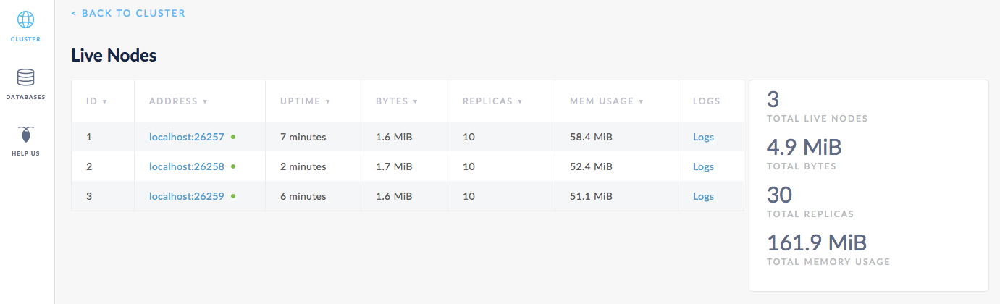
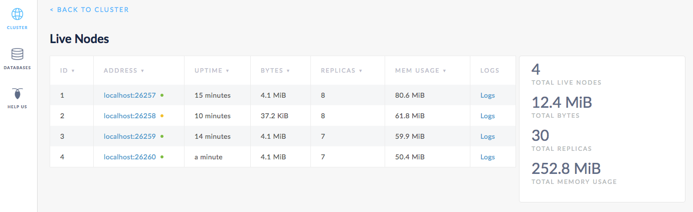
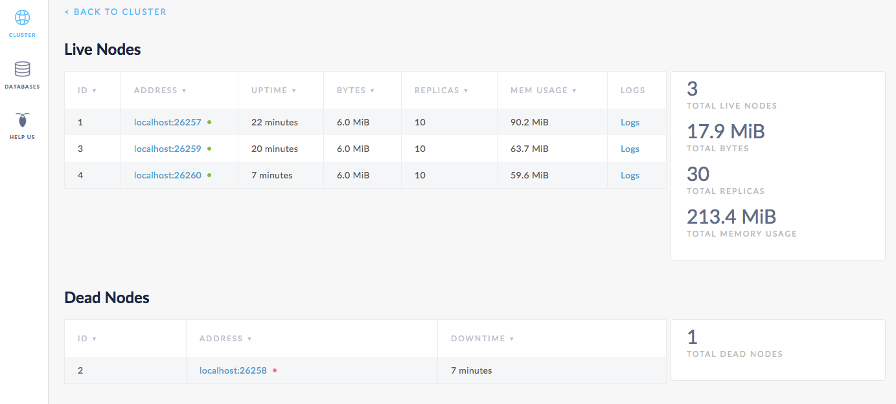

# 容错和恢复实例

本章将向你介绍 CockroachDB 如何在出错中保持可用以及在出错后恢复的一个简单实例。首先，启动一个3节点的本地集群，移除一个节点并查看集群是如何继续不间断运行的。接着当这个移除的节点离线的时候，可以写入一些数据，再重新加入这个节点，查看它是如何赶上集群剩余的节点。最后，添加第四个节点并再次移除一个节点，查看丢失的副品最终是如何再次复制给新的节点。

## 开始之前

确保你已经 [安装了 CockroachDB](install-cockroachdb.md)。

## 步骤1 启动一个3节点的集群

关于 `cockroach start` 选项的细节请查看 <a href="start-a-local-cluster.html">Start a Local Cluster</a>。

```shell
# In a new terminal, start node 1:
$ cockroach start --insecure \
--store=fault-node1 \
--host=localhost

# In a new terminal, start node 2:
$ cockroach start --insecure \
--store=fault-node2 \
--host=localhost \
--port=26258 \
--http-port=8081 \
--join=localhost:26257

# In a new terminal, start node 3:
$ cockroach start --insecure \
--store=fault-node3 \
--host=localhost \
--port=26259 \
--http-port=8082 \
--join=localhost:26257
```

## 步骤2 核实集群是否正在工作

在一个新的终端，连接 [内置的SQL 命令行](use-the-built-in-sql-client.html)：

```sql
> SHOW DATABASES;
```

```
+--------------------+
|      Database      |
+--------------------+
| crdb_internal      |
| information_schema |
| pg_catalog         |
| system             |
+--------------------+
(4 rows)
```

退出 SQL 命令行：

```sql
> \q
```

## 步骤3 临时移除一个节点

在运行这节点2的终端，按下 **CTRL + C** 使节点停止工作。

打开一个新的终端并运行 [`cockroach quit`](stop-a-node.html) 命令关闭端口 `26258`：

```shell
$ cockroach quit --insecure --port=26258
```

```
initiating graceful shutdown of server
ok
```

##步骤4 核实集群是否保持可用

切换到内置 SQL 命令行的终端，重新连接节点1的命令行 (端口 `26257`) 或者节点3的命令行 (端口 `26259`) ：

```shell
$ cockroach sql --insecure --port=26259
# Welcome to the cockroach SQL interface.
# All statements must be terminated by a semicolon.
# To exit: CTRL + D.
```

```sql
> SHOW DATABASES;
```

```
+--------------------+
|      Database      |
+--------------------+
| information_schema |
| pg_catalog         |
| bank               |
| system             |
+--------------------+
(4 rows)
```

正如你所看到的，尽管一个节点已经离线，集群还是继续不间断地运行，因为大多数副品 (2/3) 仍然可用。但是如果你再移除另一个节点，让唯一一个节点一直运行，集群就会变得迟钝直到有一个节点再次在线。

退出 SQL 命令行：

```sql
> \q
```

##步骤5 当一个节点离线的时候写入数据

在同一个终端，使用 [`cockroach gen`](generate-cockroachdb-resources.html) 命令生成一个例子 `startrek` 数据库：

```shell
$ cockroach gen example-data startrek | cockroach sql --insecure
```

```
CREATE DATABASE
SET
DROP TABLE
DROP TABLE
CREATE TABLE
INSERT 79
CREATE TABLE
INSERT 200
```

然后重新连接节点1的 SQL 命令行 (端口 `26257`) 或者节点3的命令行 (端口 `26259`) ，核实这个带着两个表 `episodes` and `quotes` 的新的 `startrek` 数据库是否已经被添加：

```shell
$ cockroach sql --insecure --port=26259
# Welcome to the cockroach SQL interface.
# All statements must be terminated by a semicolon.
# To exit: CTRL + D.
```

```sql
> SHOW DATABASES;
```

```
+--------------------+
|      Database      |
+--------------------+
| crdb_internal      |
| information_schema |
| pg_catalog         |
| startrek           |
| system             |
+--------------------+
(5 rows)
```

```sql
> SHOW TABLES FROM startrek;
```

```
+----------+
|  Table   |
+----------+
| episodes |
| quotes   |
+----------+
(2 rows)
```

```sql
> SELECT * FROM startrek.episodes LIMIT 10;
```

```
+----+--------+-----+--------------------------------+----------+
| id | season | num |             title              | stardate |
+----+--------+-----+--------------------------------+----------+
|  1 |      1 |   1 | The Man Trap                   |   1531.1 |
|  2 |      1 |   2 | Charlie X                      |   1533.6 |
|  3 |      1 |   3 | Where No Man Has Gone Before   |   1312.4 |
|  4 |      1 |   4 | The Naked Time                 |   1704.2 |
|  5 |      1 |   5 | The Enemy Within               |   1672.1 |
|  6 |      1 |   6 | Mudd's Women                   |   1329.8 |
|  7 |      1 |   7 | What Are Little Girls Made Of? |   2712.4 |
|  8 |      1 |   8 | Miri                           |   2713.5 |
|  9 |      1 |   9 | Dagger of the Mind             |   2715.1 |
| 10 |      1 |  10 | The Corbomite Maneuver         |   1512.2 |
+----+--------+-----+--------------------------------+----------+
(10 rows)
```

退出 SQL 命令行：

```sql
> \q
```

## 步骤6 集群重新加入节点

切换到节点2的终端，使用步骤1使用过的同样的命令给集群重新加入节点：

```shell
$ cockroach start --insecure \
--store=fault-node2 \
--host=localhost \
--port=26258 \
--http-port=8081 \
--join=localhost:26257
```

```
CockroachDB node starting at {{page.release_info.start_time}}
build:      CCL {{page.release_info.version}} @ {{page.release_info.build_time}}
admin:      http://localhost:8081
sql:        postgresql://root@localhost:26258?sslmode=disable
logs:       node2/logs
store[0]:   path=fault-node2
status:     restarted pre-existing node
clusterID:  {5638ba53-fb77-4424-ada9-8a23fbce0ae9}
nodeID:     2
```

##步骤7 核实重新加入的节点是否已经恢复

切换到内置 SQL 命令行的终端， 连接命令行以重新加入节点2 (端口 `26258`)，检查该节点离线的时候，数据库 `startrek` 的数据是否已经被添加：

```shell
$ cockroach sql --insecure --port=26258
# Welcome to the cockroach SQL interface.
# All statements must be terminated by a semicolon.
# To exit: CTRL + D.
```

```sql
> SELECT * FROM startrek.episodes LIMIT 10;
```

```
+----+--------+-----+--------------------------------+----------+
| id | season | num |             title              | stardate |
+----+--------+-----+--------------------------------+----------+
|  1 |      1 |   1 | The Man Trap                   |   1531.1 |
|  2 |      1 |   2 | Charlie X                      |   1533.6 |
|  3 |      1 |   3 | Where No Man Has Gone Before   |   1312.4 |
|  4 |      1 |   4 | The Naked Time                 |   1704.2 |
|  5 |      1 |   5 | The Enemy Within               |   1672.1 |
|  6 |      1 |   6 | Mudd's Women                   |   1329.8 |
|  7 |      1 |   7 | What Are Little Girls Made Of? |   2712.4 |
|  8 |      1 |   8 | Miri                           |   2713.5 |
|  9 |      1 |   9 | Dagger of the Mind             |   2715.1 |
| 10 |      1 |  10 | The Corbomite Maneuver         |   1512.2 |
+----+--------+-----+--------------------------------+----------+
(10 rows)
```

一开始，在节点2恢复过程中，它充当着另外一个节点数据的代理。这表明，即使数据的副本不是本地的节点，它也可以无缝连接。

 很快，节点2完全恢复。为了核实，可以打开管理界面 `http://localhost:8080`，点击右侧的 **View nodes list**，可以看到列表中有3个节点，副本计数也都一样。意味着，集群中的所有数据已经被复制了 3 次，每个节点中都有每条数据的一份拷贝。

CockroachDB 默认复制3次数据。使用  <a href="configure-replication-zones.html">replication zones</a> 可以自定义次数和全部集群副品及特定数据集合的本地存储位置。



## 步骤8 添加另外一个节点

现在，为了给集群永久的节点失效做准备，打开的终端，添加第四个节点：

```shell
$ cockroach start --insecure \
--store=fault-node4 \
--host=localhost \
--port=26260 \
--http-port=8083 \
--join=localhost:26257
```

```
CockroachDB node starting at {{page.release_info.start_time}}
build:      CCL {{page.release_info.version}} @ {{page.release_info.build_time}}
admin:      http://localhost:8083
sql:        postgresql://root@localhost:26260?sslmode=disable
logs:       node4/logs
store[0]:   path=fault-node4
status:     initialized new node, joined pre-existing cluster
clusterID:  {5638ba53-fb77-4424-ada9-8a23fbce0ae9}
nodeID:     4
```

## 步骤9 永久地移除一个节点

再次切换到运行着节点2的终端，按下 **CTRL + C** 使节点2停止工作。

打开新的终端，运行 [`cockroach quit`](stop-a-node.html) 命令关闭端口 `26258`：

```shell
$ cockroach quit --insecure --port=26258
```

```
initiating graceful shutdown of server
ok
server drained and shutdown completed
```

## 步骤10 核实集群中丢失的副品是否重新复制

回到 Admin UI，你可以看到列表中有4个节点。1分钟后，节点2后面的点变成黄色，表明这个节点已经无响应。



10分钟后，节点2会被移到 Dead Nodes 中，表明该节点预计不会再次运行。此时，在 **Live Nodes** 中，节点4的副品计数将会与节点1和节点3一样。这表明，所有丢失的副品(节点2中的副品)已经被重新复制到节点4。



## 步骤11 关闭集群

一旦使用完测试集群，通过切换到每个节点的终端窗口并按 **CTRL + C** 键来关闭每一个节点。

>   注：
>
>   对于最后一个节点，关机过程将会需要更长时间（大概一分钟），最终会强制杀死所有节点。这是因为，如果只留 1 个节点仍然在线，大多数副本（2/3）不再可用，导致集群不能运行。为了加快关闭过程，可在节点终端窗口中第二次按 **CTRL + C** 键。

如果你不打算重新启动这个集群，你可能想要删除节点的数据存储：

```shell
$ rm -rf fault-node1 fault-node2 fault-node3 fault-node4 fault-node5
```

## 下一节

使用一个本地集群来探索 CockroachDB 的其他核心功能：

-   [容错和恢复](demo-fault-tolerance-and-recovery.md)
-   [自动再平衡](demo-automatic-rebalancing.md)
-   [自动云迁移](demo-automatic-cloud-migration.md)