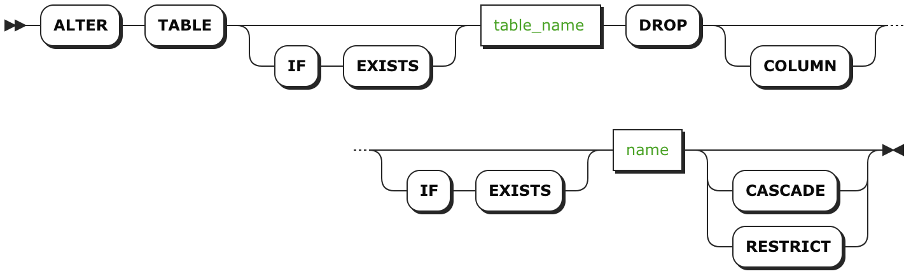

# DROP COLUMN

`DROP COLUMN` [语句](sql-statements.html) 是 `ALTER TABLE` 的一部分，将从表中删除列。

## 简介



## 所需权限

用户必须具有对表的 `CREATE` [权限](privileges.html)。

## 参数

| 参数           | 描述                                       |
| ------------ | ---------------------------------------- |
| `table_name` | 你想删除的列所在表的名称。                            |
| `name`       | 你想删除列的名称。                                |
| `CASCADE`    | 即使对象（比如  [视图](views.html)）依赖于该列，也要删除它；同时也要删除依赖对象。`CASCADE` 不列出它删除的对象，所以应该谨慎使用。然而，`CASCADE` 不会删除相关索引；你必须使用 [`DROP INDEX`](drop-index.html)。 这也防止了 `CASCADE` 从外键约束中删除列。 |
| `RESTRICT`   | （默认的）如果任何对象（比如  [视图](views.html)）依赖于它，则不删除该列。 |

## 示例

### 删除列

如果你不再想列在表中，可以删除它。

``` sql
> ALTER TABLE orders DROP COLUMN billing_zip;
```

### 防止删除有依赖对象的列 (`RESTRICT`)

如果该列具有依赖对象，比如 [视图](views.html)，CockroachDB 默认将不删除该列；然而，如果你确认要删除它，可以包含 `RESTRICT` 子句。

``` sql
> ALTER TABLE orders DROP COLUMN customer RESTRICT;
```
```
pq: 不能删除 "customer" 列，因为视图 "customer_view" 依赖于它
```

### 删除列和其依赖的对象 (`CASCADE`) 

如果你想删除该列和所有依赖项，包含 `CASCADE` 子句。

***警告***

`CASCADE` 不列出它删除的对象，所以应该谨慎使用。

``` sql
> SHOW CREATE VIEW customer_view;
```
```
+---------------+----------------------------------------------------------------+
|     View      |                          CreateView                            |
+---------------+----------------------------------------------------------------+
| customer_view | CREATE VIEW customer_view AS SELECT customer FROM store.orders |
+---------------+----------------------------------------------------------------+
```
``` sql
> ALTER TABLE orders DROP COLUMN customer CASCADE;
> SHOW CREATE VIEW customer_view;
```
```
pq: 视图 "customer_view" 不存在
```

## 参考

- [`DROP CONSTRAINT`](drop-constraint.html)
- [`DROP INDEX`](drop-index.html)
- [`ALTER TABLE`](alter-table.html)
