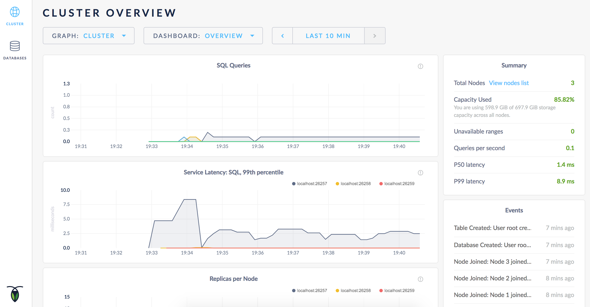
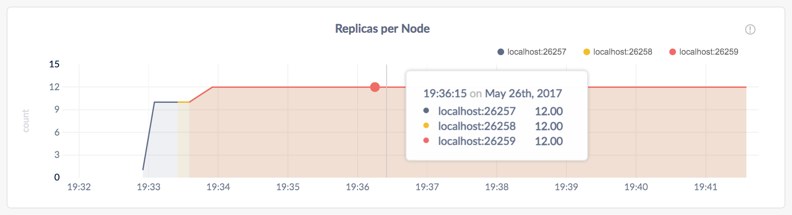

# 启动一个本地集群（安全的）

只要你已经[安装了官方的 CockroachDB Docker 镜像](install-cockroachdb.md)，通过使用[TLS 证书](create-security-certificates.html) 加密网络通信，在本地启动安全的多节点集群是很简单的。

> ***警告***

> 在单台主机上运行多个节点在测试 CockroachDB 是非常有用的，但不推荐用于生产环境部署。要在生产环境中运行物理分布式集群，查看[手动部署](manual-deployment.md)，[云部署](cloud-deployment.md)或[编排](orchestration.md)。

## 准备

确认你已经[安装了官方的 CockroachDB Docker 镜像](install-cockroachdb.md)。

## 第一步.  创建安全证书

~~~ shell
# Create a certs directory and safe directory for the CA key.
# If using the default certificate directory (`${HOME}/.cockroach-certs`), make sure it is empty.
$ mkdir certs
$ mkdir my-safe-directory

# Create the CA key pair:
$ cockroach cert create-ca \
--certs-dir=certs \
--ca-key=my-safe-directory/ca.key

# Create a client key pair for the root user:
$ cockroach cert create-client \
root \
--certs-dir=certs \
--ca-key=my-safe-directory/ca.key

# Create a key pair for the nodes:
$ cockroach cert create-node \
localhost \
$(hostname) \
--certs-dir=certs \
--ca-key=my-safe-directory/ca.key
~~~

- 第一条命令为证书创建一个新目录。
- 第二条命令创建证书颁发机构（CA）证书和密钥：`ca.crt` 和 `ca.key`。
- 第三条命令创建客户端证书和密钥，在本例中是为 `root` 用户：`client.root.crt` 和 `client.root.key`。这些文件将用于加密内置的 SQL shell 和集群之间的通信（见第四步）。
- 第四条命令创建节点证书和密钥： `node.crt` 和 `node.key`。这些文件将用于加密节点之间的通信。通常，将为每个节点单独生成这些文件，因为每个节点都有唯一的地址；然而在本例中，由于所有节点都将在本地运行，所以只需要生成一个节点证书和密钥。

## 第二步.  启动第一个节点

~~~ shell
$ cockroach start \
--certs-dir=certs \
--host=localhost \
--http-host=localhost
~~~

~~~
CockroachDB node starting at 2017-07-27 10:29:13.675508543 -0400 EDT
build:      CCL v1.0.4 @ 2017/07/27 12:56:53 (go1.8.3)
admin:      https://ROACHs-MBP:8080
sql:        postgresql://root@ROACHs-MBP:26257?sslcert=%2FUsers%2F...
logs:       cockroach-data/logs
store[0]:   path=cockroach-data
status:     restarted pre-existing node
clusterID:  {dab8130a-d20b-4753-85ba-14d8956a294c}
nodeID:     1
~~~

这条命令在安全模式下启动了一个节点，接受大多数  [`cockroach start`](start-a-node.md) 默认值。 

- `--certs-dir` 目录指向持有证书和密钥的目录。
- 由于这是一个纯本地集群，`--host=localhost` 告知节点只监听 `localhost` 上的默认端口，`26257` 端口用于监听内部和客户端通信，`8080` 端口用于监听来自管理 UI 的 HTTP 请求。
- 管理 UI 默认为监听所有接口。因此 `--http-host` 标志用于限制管理 UI 对指定接口的访问权限，在此例中是 `localhost`。
- 节点数据存储在 `cockroach-data` 目录。
- [标准输出](start-a-node.md#standard-output)提供了一些有用的细节，比如 CockroachDB 版本，管理 UI 的 URL，以及客户端的 SQL URL。

> **提示**：

> 默认情况下，每个节点的缓存仅限于可用内存的 25%。当每台主机运行一个容器/节点时，这个默认值是合理的。然而当在单台主机上运行多个容器/节点时，可能导致内存错误，尤其是对集群进行认真测试时。为避免这样的错误，可以通过设置 `start` 命令中的 `—cache` 标志来手动限制每个节点的缓存大小。

## 第三步. 向集群中添加节点

此时，集群处于活动状态。只用一个节点，你已经可以连接 SQL 客户端并开始构建数据库。然而，在实际部署中，你将想用 3 个或更多节点来利用 CockroachDB 的 [自动复制](demo-data-replication.md)，[再平衡](demo-automatic-rebalancing.md)和[容错](demo-fault-tolerance-and-recovery.md)功能。这一步帮助你在本地模拟真实的部署。

在一个新的终端中，添加第二个节点：

~~~ shell
$ cockroach start \
--certs-dir=certs \
--store=node2 \
--host=localhost \
--port=26258 \
--http-port=8081 \
--http-host=localhost \
--join=localhost:26257
~~~

在一个新的终端中，添加第三个节点：

~~~ shell
$ cockroach start \
--certs-dir=certs \
--store=node3 \
--host=localhost \
--port=26259 \
--http-port=8082 \
--http-host=localhost \
--join=localhost:26257
~~~

这些命令的主要不同是用于将新节点连接到集群的 `—join` 标志，此例中指定第一个节点的地址和端口为 `localhost:26257`。由于是在同一台机器上运行所有节点，还将 `—store`，`—port` 和 `--http-port` 标志设置为其它节点不使用位置和端口，但是在真实部署中，对于不同机器上的每个节点，默认值就足够了。

## 第四步. 测试集群

现在已经扩展到了 3 个节点，可以使用任何一个节点作为集群的 SQL 网关。为了显示这一点，使用 `docker exec` 命令在第一个容器中启动内置的 [SQL shell](use-the-built-in-sql-client.md)：

> ***警告***

> SQL 客户端已经内置到 `cockroach` 二进制文件中，无需额外操作。

~~~ shell
$ cockroach sql \
--certs-dir=certs
# Welcome to the cockroach SQL interface.
# All statements must be terminated by a semicolon.
# To exit: CTRL + D.
~~~

运行一些基本的 [CockroachDB SQL 语句](learn-cockroachdb-sql.md)：

~~~ sql
> CREATE DATABASE bank;

> CREATE TABLE bank.accounts (id INT PRIMARY KEY, balance DECIMAL);

> INSERT INTO bank.accounts VALUES (1, 1000.50);

> SELECT * FROM bank.accounts;
~~~

~~~
+----+---------+
| id | balance |
+----+---------+
|  1 |  1000.5 |
+----+---------+
(1 row)
~~~

退出节点 1 上的 SQL shell：

~~~ sql
> \q
~~~

然后将 SQL shell 连接到第二个节点，这次指定节点的非默认端口：

~~~ shell
$ cockroach sql \
--certs-dir=certs \
--port=26258
# Welcome to the cockroach SQL interface.
# All statements must be terminated by a semicolon.
# To exit: CTRL + D.
~~~

> ***警告***

> 在真实部署环境中，所有节点都可能使用默认节点 `26257`，所以无需设置 `—port`。

现在运行同样的 `SELECT` 查询：

~~~ sql
> SELECT * FROM bank.accounts;
~~~

~~~
+----+---------+
| id | balance |
+----+---------+
|  1 |  1000.5 |
+----+---------+
(1 row)
~~~

如你所见，节点 1 和节点 2 的行为和 SQL 网关相同。

退出节点 2 上的 SQL shell：

~~~ sql
> \q
~~~

## 第五步. 监控集群

要访问集群的[管理 UI](explore-the-admin-ui.md)，用浏览器连接到 `http://localhost:8080`，或者连接到任何节点启动时的标准输出中的 `admin` 字段的地址。

注意，浏览器将认为 CockroachDB-created 证书无效，需要单击一条警告消息才能获取 UI。

如前所述，CockroachDB 自动在后台复制数据。为了验证在前面步骤中写入的数据被成功复制，向下滚动到*每个节点的存储*并将光标悬停在线上：

每个节点上的副本数量是相同的，表明集群中的所有数据被复制了 3 次（默认值）。

> **提示**：

> 为了更深入的了解 CockroachDB 是怎样自动复制、再平衡数据、容错和故障恢复的，查看 [复制](demo-data-replication.md)，[再平衡](demo-automatic-rebalancing.md)，[容错](demo-fault-tolerance-and-recovery.html)演示。

## 第六步.  停止集群

完成集群测试之后，切换到运行第一个节点的终端，并按下 **CTRL + C** 键来停止该节点。

此时，有 2 个节点仍然在线，集群仍然可用，因为大多数副本都可用。要验证集群是否容忍了这种 “失败”，将内置 SQL shell 连接到节点 2 或节点 3。可以在同一终端中或新终端中执行此操作。

~~~ shell
$ cockroach sql \
--certs-dir=certs \
--port=26258
# Welcome to the cockroach SQL interface.
# All statements must be terminated by a semicolon.
# To exit: CTRL + D.
~~~

~~~ sql
> SELECT * FROM bank.accounts;
~~~

~~~
+----+---------+
| id | balance |
+----+---------+
|  1 |  1000.5 |
+----+---------+
(1 row)
~~~

退出 SQL shell:

~~~ sql
> \q
~~~

现在通过切换到相应终端并按下 **CTRL + C** 键来停止节点 2 或节点 3。

> **提示**：

> 对于节点 3，关闭过程将需要更长时间（将近一分钟），并且最终将强制杀死该节点。这是因为，只剩下 3 个节点中的 1 个，大多数副本不可用，因此集群已经不可用。要加快这个过程，按第二次 **CTRL + C** 。

如果不打算重启集群，可能需要删除节点的数据存储区：

~~~ shell
$ rm -rf cockroach-data node2 node3
~~~

## 第七步. 重启集群

如果决定使用集群进行进一步的测试，则需要从包含节点数据存储的目录中至少重启 3 个节点中的 2 个节点。

从 `cockroach-data/` 的父目录重启第一个节点：

~~~ shell
$ cockroach start \
--certs-dir=certs \
--host=localhost \
--http-host=localhost
~~~

> ***警告***

> 只有 1 个节点在线后，集群还不可用，所以在重启第二个节点之前，将不会看到对以上命令的响应。

在新的终端中，从 `node2/` 的父目录重启第二个节点：

~~~ shell
$ cockroach start \
--certs-dir=certs \
--store=node2 \
--host=localhost \
--port=26258 \
--http-port=8081 \
--http-host=localhost \
--join=localhost:26257
~~~

在新的终端中，从 `node3/` 的父目录重启第三个节点：

~~~ shell
$ cockroach start \
--certs-dir=certs \
--store=node3 \
--host=localhost \
--port=26259 \
--http-port=8082 \
--http-host=localhost \
--join=localhost:26257
~~~

## 下一步

- 学习更多关于 [CockroachDB SQL](learn-cockroachdb-sql.md) 和 [内建 SQL 客户端](use-the-built-in-sql-client.md)
- 安装你喜欢的语言的[客户端驱动程序](install-client-drivers.md) 
- [用 CockroachDB 构建一个应用](build-an-app-with-cockroachdb.md)
- [探索 CockroachDB 的核心功能](demo-data-replication.md)，比如自动复制，再平衡和容错。
