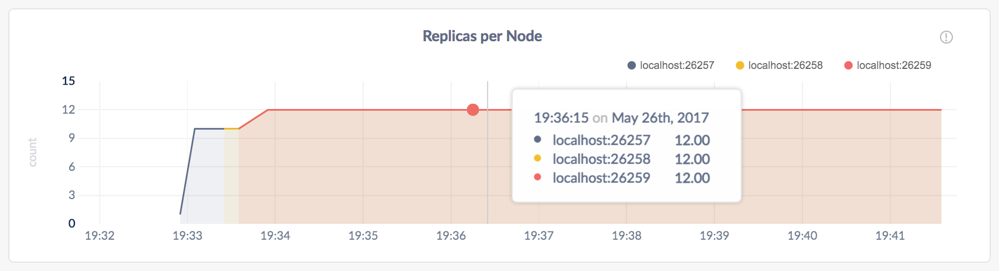

# 启动一个本地集群（不安全的）

搭建并运行一个具有多个节点的本地 CockroachDB 集群，并且每一个节点都监听不同的端口。

- 不安全的
- [安全的](secure-a-cluster.md)

当安装完 CockroachDB 后，搭建一个不安全的多节点本地集群将非常容易。

> **注意：**

> 在单台主机上运行多个节点在测试 CockroachDB 是非常有用的，但不推荐用于生产环境部署。要在生产环境中运行物理分布式集群，参见[手动部署](manual-deployment.md)，[云部署](cloud-deployment.md)或[编排](orchestration.md)。

## 准备

确认你已经[安装了 CockroachDB](install-cockroachdb.md)。

## 第一步：部署第一个节点

```sh
$ cockroach start --insecure \
--host=localhost
```

```sh
CockroachDB node starting at {{page.release_info.start_time}}
build:      CCL {{page.release_info.version}} @ {{page.release_info.build_time}}
admin:      http://localhost:8080
sql:        postgresql://root@localhost:26257?sslmode=disable
logs:       cockroach-data/logs
store[0]:   path=cockroach-data
status:     initialized new cluster
clusterID:  {dab8130a-d20b-4753-85ba-14d8956a294c}
nodeID:     1
```

以上命令以非安全模式搭建了一个节点，且接受大部分 [`cockroach 部署`](start-a-node.md) 默认设置。

* `--insecure` 标志设置通信不加密。
* 因为这是一个纯本地集群，`--host=localhost` 告诉该节点只监听 `localhost`, 并且都使用默认端口 (`26257`) 进行对内和客户端通信以及处理来自 Admin UI (`8080`)的  HTTP 请求。
* 节点的数据保存在 `cockroach-data` 目录中。
* [标准输出](start-a-node.md#standard-output) 提供了 CockroachDB 的有用的细节，如版本信息和 SQL 客户端的 URL。

> **提示：**

> 每个节点的缓存默认被设置为系统可用内存的 25%。当每台主机上运行一个节点时，默认设置是合理的。但当单一主机运行多个节点，默认设置可能导致内存溢出错误，尤其是严格测试时。为了避免这种错误，可以在 `start` 命令中通过 `--cache` 标志限制每个节点的缓存大小。

## 第二步：向集群中添加节点

此时，你的集群已经运行。在已有的一个节点上，你可以连接一个 SQL 客户端并开始搭建数据库。然而在实际部署中，你总会希望有三个或更多的节点以发挥 CockroachDB 的[自动化复制](demo-data-replication.md), [再平衡](demo-automatic-rebalancing.md)和[容错](demo-fault-tolerance-and-recovery.md)能力。这一步将帮助你模拟一个真正的本地部署。

打开一个新的终端窗口，添加第二个节点：

```sh
$ cockroach start --insecure \
--store=node2 \
--host=localhost \
--port=26258 \
--http-port=8081 \
--join=localhost:26257
```

再打开一个新的终端窗口，添加第三个节点：

```shell
$ cockroach start --insecure \
--store=node3 \
--host=localhost \
--port=26259 \
--http-port=8082 \
--join=localhost:26257
```

这些命令中主要不同是使用 `--join` 标志连接新节点到集群，指定第一个节点的地址和端口，这里是 `localhost:26257`。由于你在同一台主机上运行所有节点，你还需要通过 `--store`，`--port` 和 `--http-port` 标志设置未被其他节点使用的地址和端口，但在实际部署中，每个节点在不同的机器上，默认设置就足够了。

## 第三步：集群测试

现在你已经将集群规模扩展至三个节点，你可以使用任意一个节点作为集群的 SQL 网关。为了证明这一点，打开一个新的终端窗口并将[内建 SQL 客户端](use-the-built-in-sql-client.md)连接至节点 1:

> **注意：**

>SQL 客户端内建于 `cockroach` 二进制文件中，所以不需要另外的程序。

```sh
$ cockroach sql --insecure
```

运行一些基本的 [CockroachDB SQL 语句](learn-cockroachdb-sql.md):

``` sql
> CREATE DATABASE bank;
```

``` sql
> CREATE TABLE bank.accounts (id INT PRIMARY KEY, balance DECIMAL);
```

``` sql
> INSERT INTO bank.accounts VALUES (1, 1000.50);
```

``` sql
> SELECT * FROM bank.accounts;
```

```sql
+----+---------+
| id | balance |
+----+---------+
|  1 |  1000.5 |
+----+---------+
(1 row)
```

退出节点 1 上的 SQL shell：

``` sql
> \q
```

接下来连接 SQL shell 到节点 2，这次指定节点的非默认端口:

```sh
$ cockroach sql --insecure --port=26258
```

> **注意：**

> 在实际部署中，所有的节点会使用默认端口 `26257`，因此无需设置 `--port` 标志。

现在，运行同样的 `SELECT` 查询:

``` sql
> SELECT * FROM bank.accounts;
```

```sql
+----+---------+
| id | balance |
+----+---------+
|  1 |  1000.5 |
+----+---------+
(1 row)
```

可以看到，节点 1 和节点 2 作为 SQL 网关的行为是一致的。

退出节点 2 上的 SQL shell:

``` sql
> \q
```

## 第四步：集群监控

访问集群的 [Admin UI](explore-the-admin-ui.md)，将浏览器指向 `http://localhost:8080`或任意节点启动时标准输出中 `admin` 域指定的地址:


前面提到过，CockroachDB 在后台自动复制数据。为了验证前一步中写入的数据已成功复制，将页面滚动至 **Replicas per Node** 图并且将光标悬停在折线上:



每个节点上的副本数是相同的，表示集群中的数据被复制了三次（默认）。

> **提示：**

> 如果要更深入了解 CockroachDB 如何自动复制、再平衡数据、容错和从故障中恢复，请查看[复制](demo-data-replication.md)、[再平衡](demo-automatic-rebalancing.md)、[容错](demo-fault-tolerance-and-recovery.md)演示。

## 第五步：关闭集群

当你完成了对集群的测试，转到运行第一个节点的终端窗口，按 **CTRL + C** 键关闭该节点。

此时，仍然有 2 个节点在线，因为大多数副本仍然可用，集群仍保持运行。为了验证集群容忍了这个“失效”，连接内建的 SQL shell 到节点 2 或 3。以下命令可以在同一个终端窗口运行也可以在新的终端窗口中运行：

```sh
$ cockroach sql --insecure --port=26258
```

``` sql
> SELECT * FROM bank.accounts;
```

```sql
+----+---------+
| id | balance |
+----+---------+
|  1 |  1000.5 |
+----+---------+
(1 row)
```

退出 SQL shell：

``` sql
> \q
```

现在，可以进入节点 2 和 3 各自的终端并按 **CTRL + C** 键来关闭节点。

> **提示：**

>节点 3 的关闭过程将耗费较长时间（约 1 分钟）并最终强制杀掉这个节点。这是因为当三个节点中只有留下一个时，大多数的副本已不可用，因此集群也不再运行。若要加速这个过程，第二次按 **CTRL + C**键。

如果你不打算重启集群，可以移除节点数据的存储：

```sh
$ rm -rf cockroach-data node2 node3
```

## 第六步：重启集群

如果你决定使用集群做进一步的测试，则需要从包含节点数据存储的目录中重新启动三个节点中的至少两个节点。

在 `cockroach-data/` 的父目录中重启第一个节点：

``` shell
$ cockroach start --insecure \
--host=localhost
```

> **注意：**

> 只有唯一的一个节点重新上线，集群还不能运行，所以在重新启动第二个节点之前，你不会看到对上述命令的响应。

打开一个新的终端窗口，在 `node2/` 的父目录中重启第二个节点：

``` shell
$ cockroach start --insecure \
--store=node2 \
--host=localhost \
--port=26258 \
--http-port=8081 \
--join=localhost:26257
```

再打开一个新的终端窗口，在 `node3/` 的父目录中重启第三个节点：

``` shell
$ cockroach start --insecure \
--store=node3 \
--host=localhost \
--port=26259 \
--http-port=8082 \
--join=localhost:26257
```

## 下一步

- 学习更多关于 [CockroachDB SQL](learn-cockroachdb-sql.md) 和 [内建 SQL 客户端](use-the-built-in-sql-client.md)
- 安装你喜欢的语言的[客户端驱动程序](install-client-drivers.md) 
- [使用 CockroachDB 构建一个应用](build-an-app-with-cockroachdb.md)
- [探索 CockroachDB 的核心功能](demo-data-replication.md)，比如自动复制、再平衡、容错和云迁移。