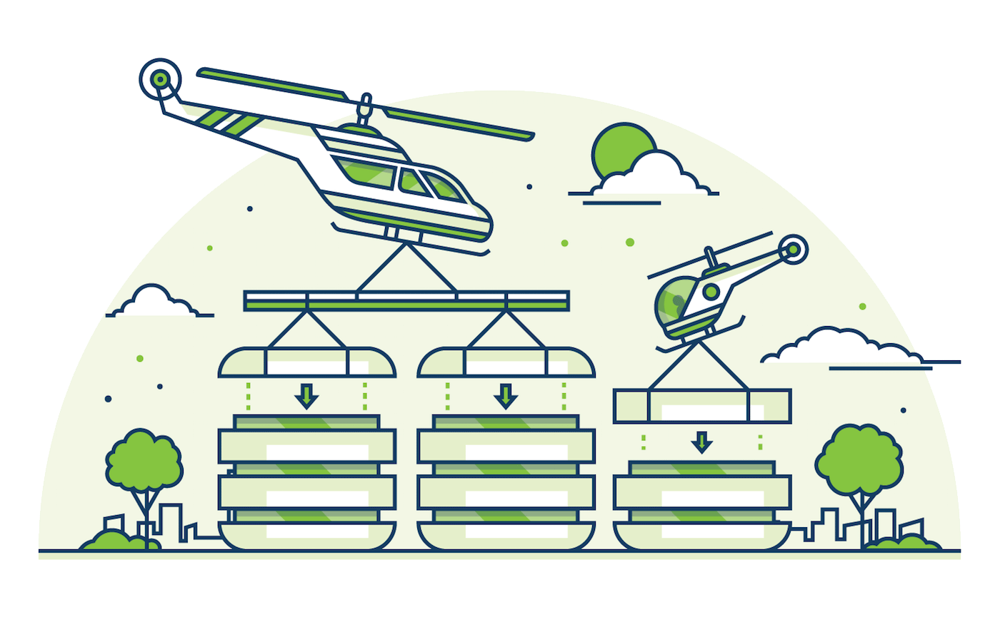

# 强一致性

CockroachDB 多次复制你的数据并保证副本之间的一致性。

关键特性：

-   [只要时钟与 NTP 同步](https://www.cockroachlabs.com/blog/living-without-atomic-clocks/)，CockroachDB 保证可序列化 SQL 事务
-   服务器重启、机器故障，或者数据中心停电不会造成停机
-   本地或广域的复制在故障转移时没有陈旧的读
-   使用 Raft，Paxos 的一个流行的后继者

这如何工作？

- 存储的数据用 MVCC 标记版本，所以读简单地限制其范围到读事务启动时见到的数据。

- 写使用
  [Raft 共识算法](https://raft.github.io/)被服务，这是
  [Paxos](http://research.microsoft.com/en-us/um/people/lamport/pubs/paxos-simple.pdf) 的一个流行的替代品。
  共识算法保证任何的多数副本总是同意于一个更新是否被成功提交。更新（写）达到多数副本（默认为三个中的两个）才被认为被提交了。

  为了保证写事务不干扰在它之后开始的读事务，CockroachDB 也使用一个记住数据何时被进行的事务最后读的[时间戳缓存](https://www.cockroachlabs.com/blog/serializable-lockless-distributed-isolation-cockroachdb/)。

  这确保客户端总是观察到关于其它并发事务的可序列化一致性。

## 另见

- [可序列化、无锁、分布式：CockroachDB 中的隔离](https://www.cockroachlabs.com/blog/serializable-lockless-distributed-isolation-cockroachdb/)
- [共识使其茁壮成长](https://www.cockroachlabs.com/blog/consensus-made-thrive/)
- [信任但验证：CockroachDB 如何检查复制](https://www.cockroachlabs.com/blog/trust-but-verify-cockroachdb-checks-replication/)
- [不需要原子时钟的方式](https://www.cockroachlabs.com/blog/living-without-atomic-clocks/)
- [CockroachDB 系统架构文档](../design_cn.md)
